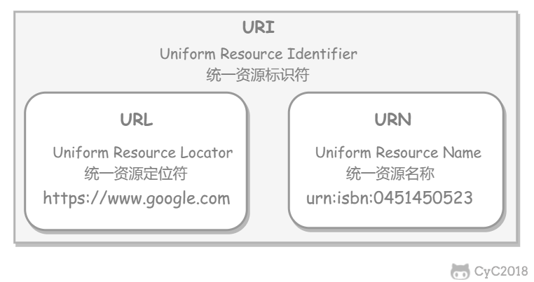
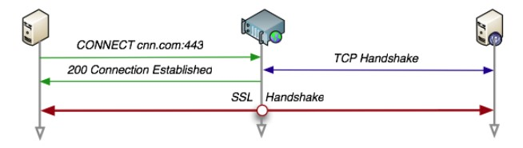
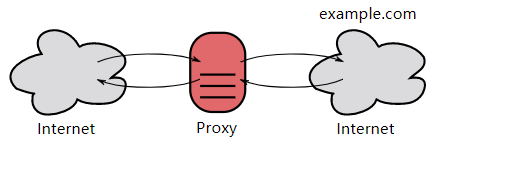
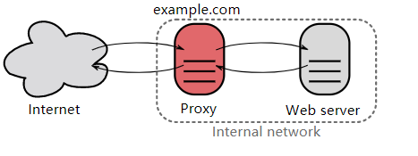
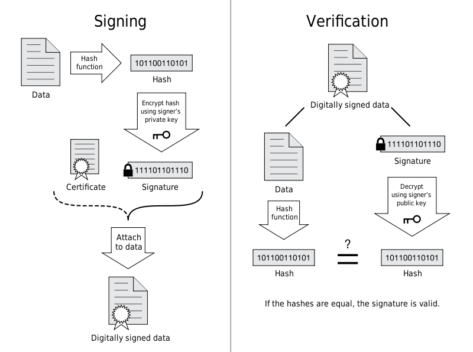
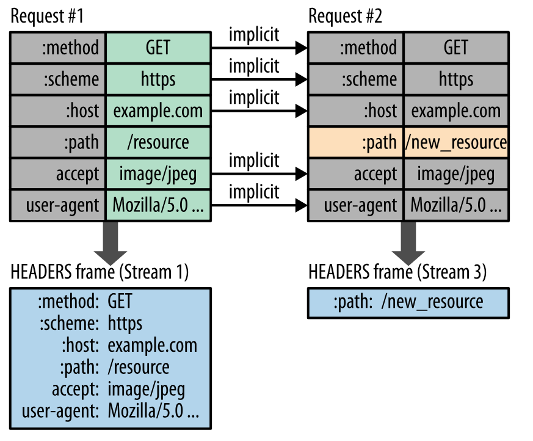

# 互联网软件开发学习笔记

> By 屈仟 1801210872

## HTML 入门

1. HTML 结构
  HTML 由大量的标签组成
- 标签分类：结构 <标签名>
  （1）单标签  <标签名 />
  （2）双标签  <标签名></标签名>
- HTML 的固定结构：
    ```html
    <html>
    <head>
    <title>demo 网页</title>
    </head>
    <body>demo 内容</body>
    </html>
    ```
    注意事项：标签必须正确的结束，特别是双标签

2. HTML 属性
   HTML 标签可以拥有属性。属性提供了有关 HTML 元素的更多的信息。
     属性总是以名称/值对的形式出现，比如：name="value"。
     属性总是在 HTML 元素的开始标签中规定。
     实例：HTML 链接由 `<a>` 标签定义。链接的地址在 href 属性中指定：
   ```html
   <a href="http://www.google.com">This is a link</a>
   ```
   始终为属性值加引号
   属性值应该始终被包括在引号内。双引号是最常用的，不过使用单引号也没有问题。
   在某些个别的情况下，比如属性值本身就含有双引号，那么您必须使用单引号，例如：
   name='Bill "HelloWorld" Gates'

   下面列出了适用于大多数 HTML 元素的属性：
   <table>
   <tr>
   <th>属性</th>
   <th>值</th>
   <th>描述</th>
   </tr>
   <tr>
   <td>class</td>
   <td><i>classname</i></td>
   <td>规定元素的类名（classname）</td>
   </tr>
   <tr>
   <td>id</td>
   <td><i>id</i></td>
   <td>规定元素的唯一 id</td>
   </tr>
   <tr>
   <td>style</td>
   <td><i>style_definition</i></td>
   <td>规定元素的行内样式（inline style）</td>
   </tr>
   <tr>
   <td>title</td>
   <td><i>text</i></td>
   <td>规定元素的额外信息（可在工具提示中显示）</td>
   </tr>
   </table>

3. HTML 注释
- 注释的作用：可以在源代码中看见，但是在页面运行看不见的代码，可以方便对代码进行解释说明，或者某一段不需要的代码也可以使用注释
- 注释的结构：`<!--注释的内容-->`

4. HTML 标签
- HTML 标题（Heading）是通过 `<h1> - <h6>` 等标签进行定义的，1-6 表示不同级别的标题。
  实例:

    ```html
  <h1>This is a heading</h1>
  <h2>This is a heading</h2>
  <h3>This is a heading</h3>
    ```
    注释：
    默认情况下，HTML 会自动地在块级元素前后添加一个额外的空行，比如段落、标题元素前后。
    `<hr />` 标签在 HTML 页面中创建水平线。
    hr 元素可用于分隔内容。
- HTML 段落是通过 `<p>` 标签进行定义的。
实例:
    ```html
  <p>This is a paragraph.</p>
  <p>This is another paragraph.</p>
    ```
    注释：
    浏览器会自动地在段落的前后添加空行。（`<p>` 是块级元素）
    使用空的段落标记 `<p></p>` 去插入一个空行是个坏习惯。用 `<br />` 标签代替它
- HTML 样式
style 属性用于改变 HTML 元素的样式。
    - background-color 属性为元素定义了背景颜色：
        ```html
        <html>
        <body style="background-color:yellow">
        <h2 style="background-color:red">This is a heading</h2>
        <p style="background-color:green">This is a paragraph.</p>
        </body>
        </html>
        ```
    - font-family、color 以及 font-size 属性分别定义元素中文本的字体系列、颜色和字体尺寸：：
        ```html
        <html>
        <body style="background-color:yellow">
        <h1 style="font-family:verdana">A heading</h1>
        <p style="font-family:arial;color:red;font-size:20px;">A paragraph.</p>
        </body>
        </html>
        ```
    - text-align 属性规定了元素中文本的水平对齐方式：
        ```html
        <html>
        <body style="background-color:yellow">
        <h1 style="text-align:center">This is a heading</h1>
        <p>The heading above is aligned to the center of this page.</p>
        </body>
        </html>
        ```
- HTML 文本格式化
    <table class="dataintable">
    <tr>
    <th style="width:30%">标签</th>
    <th style="width:70%">描述</th>
    </tr>
    <tr>
    <td><a href="/tags/tag_font_style.asp">&lt;b&gt;</a></td>
    <td>定义粗体文本。</td>
    </tr>
    <tr>
    <td><a href="/tags/tag_font_style.asp">&lt;big&gt;</a></td>
    <td>定义大号字。</td>
    </tr>
    <tr>
    <td><a href="/tags/tag_phrase_elements.asp">&lt;em&gt;</a></td>
    <td>定义着重文字。</td>
    </tr>
    <tr>
    <td><a href="/tags/tag_font_style.asp">&lt;i&gt;</a></td>
    <td>定义斜体字。</td>
    </tr>
    <tr>
    <td><a href="/tags/tag_font_style.asp">&lt;small&gt;</a></td>
    <td>定义小号字。</td>
    </tr>
    <tr>
    <td><a href="/tags/tag_phrase_elements.asp">&lt;strong&gt;</a></td>
    <td>定义加重语气。</td>
    </tr>
    <tr>
    <td><a href="/tags/tag_sup.asp">&lt;sub&gt;</a></td>
    <td>定义下标字。</td>
    </tr>
    <tr>
    <td><a href="/tags/tag_sup.asp">&lt;sup&gt;</a></td>
    <td>定义上标字。</td>
    </tr>
    <tr>
    <td><a href="/tags/tag_ins.asp">&lt;ins&gt;</a></td>
    <td>定义插入字。</td>
    </tr>
    <tr>
    <td><a href="/tags/tag_del.asp">&lt;del&gt;</a></td>
    <td>定义删除字。</td>
    </tr>
    <tr>
    <td><a href="/tags/tag_strike.asp">&lt;s&gt;</a></td>
    <td class="deprecated"><em>不赞成使用。</em>使用 &lt;del&gt; 代替。</td>
    </tr>
    <tr>
    <td><a href="/tags/tag_strike.asp">&lt;strike&gt;</a></td>
    <td class="deprecated"><em>不赞成使用。</em>使用 &lt;del&gt; 代替。</td>
    </tr>
    <tr>
    <td><a href="/tags/tag_u.asp">&lt;u&gt;</a></td>
    <td class="deprecated"><em>不赞成使用。</em>使用样式（style）代替。</td>
    </tr>
    </table>
    实例：
- HTML 链接是通过 `<a>` 标签进行定义的。
实例:
    ```html
  <a href="http://www.google.com">This is a link</a>
    ```
    提示："链接文本" 不必一定是文本。图片或其他 HTML 元素都可以成为链接。
    - Target 属性
      使用 Target 属性，你可以定义被链接的文档在何处显示。下面的这行会在新窗口打开文档：
      `<a href="http://www.w3school.com.cn/" target="_blank">Visit W3School!</a>`
    - name 属性
      name 属性规定锚（anchor）的名称。
      当使用命名锚（named anchors）时，我们可以创建直接跳至该命名锚（比如页面中某个小节）的链接，这样使用者就无需不停地滚动页面来寻找他们需要的信息了。
      实例:
      首先，我们在 HTML 文档中对锚进行命名（创建一个书签）：
      `<a name="tips">基本的注意事项 - 有用的提示</a>`
      然后，我们在同一个文档中创建指向该锚的链接：
      `<a href="#tips">有用的提示</a>`
      您也可以在其他页面中创建指向该锚的链接：
      `<a href="http://www.w3school.com.cn/html/html_links.asp#tips">有用的提示</a>`
      在上面的代码中，我们将 # 符号和锚名称添加到 URL 的末端，就可以直接链接到 tips 这个命名锚了。
- HTML 图像是通过 `` 标签进行定义的。
实例:
    ```html
  
    ```
- HTML 表格由 `<table>` 标签来定义。每个表格均有若干行（由 `<tr>` 标签定义），每行被分割为若干单元格（由 `<td>` 标签定义）。字母 td 指表格数据（table data），即数据单元格的内容。数据单元格可以包含文本、图片、列表、段落、表单、水平线、表格等等。
实例:
    ```html
  <table >
  <tr>
  <td>row 1, cell 1</td>
  <td>row 1, cell 2</td>
  </tr>
  <tr>
  <td>row 2, cell 1</td>
  <td>row 2, cell 2</td>
  </tr>
  </table>
    ```
- HTML 列表支持有序、无序和定义列表
    - 无序列表是一个项目的列表，此列项目使用粗体圆点（典型的小黑圆圈）进行标记。无序列表始于 `<ul>` 标签。每个列表项始于 `<li>`。
    实例:
    ```html
    <ul>
    <li>Coffee</li>
    <li>Milk</li>
    </ul>
    ```
    - 同样，有序列表也是一列项目，列表项目使用数字进行标记。有序列表始于 `<ol>` 标签。每个列表项始于 `<li>` 标签。
     ```html
    <ol>
    <li>Coffee</li>
    <li>Milk</li>
    </ol>
     ```
    - 自定义列表不仅仅是一列项目，而是项目及其注释的组合。自定义列表以 `<dl>` 标签开始。每个自定义列表项以 `<dt>` 开始。每个自定义列表项的定义以 `<dd>` 开始。
    ```html
    <dl>
    <dt>Coffee</dt>
    <dd>Black hot drink</dd>
    <dt>Milk</dt>
    <dd>White cold drink</dd>
    </dl>
    ```
- HTML `<div>` 和 `<span>`
    - HTML 块元素
    大多数 HTML 元素被定义为块级元素或内联元素。
    注：“块级元素”译为 block level element，“内联元素”译为 inline element。
    块级元素在浏览器显示时，通常会以新行来开始（和结束）。
    例子：`<h1>, <p>, <ul>, <table>`
    - HTML 内联元素
    内联元素在显示时通常不会以新行开始。
    例子：`<b>, <td>, <a>, `

    - HTML `<div>` 元素
    HTML `<div>` 元素是块级元素，它是可用于组合其他 HTML 元素的容器。
    `<div>` 元素没有特定的含义。除此之外，由于它属于块级元素，浏览器会在其前后显示折行。
    如果与 CSS 一同使用，`<div>` 元素可用于对大的内容块设置样式属性。
    `<div>` 元素的另一个常见的用途是文档布局。它取代了使用表格定义布局的老式方法。使用 `<table>` 元素进行文档布局不是表格的正确用法。`<table>` 元素的作用是显示表格化的数据。
    - HTML `<span>` 元素
    HTML `<span>` 元素是内联元素，可用作文本的容器。
    `<span>` 元素也没有特定的含义。
    当与 CSS 一同使用时，`<span>` 元素可用于为部分文本设置样式属性。

## CSS入门

1. CSS是什么

- 层叠样式表(英文全称：Cascading Style Sheets)是一种用来表现HTML或XML等文件样式的计算机语言。
- CSS 能够对网页中元素位置的排版进行像素级精确控制，支持几乎所有的字体字号样式，拥有对网页对象和模型样式编辑的能力。
- 样式通常保存在外部的 .css 文件中。只需要编辑一个简单的 CSS 文档就可以指定页面的布局和外观。

2. CSS语法

- CSS 规则由两个主要的部分构成：选择器，以及一条或多条声明。
- `selector {declaration1; declaration2; ... declarationN }`
- 每条声明由一个属性和一个值组成。每个属性有一个值。属性和值被冒号分开。
- `selector {property: value}`

3. CSS引用方式

- 外部样式表

```css
<head>
<link rel="stylesheet" type="text/css" href="mystyle.css">
</head>
```

- 内部样式表

```css
<head>
<style type="text/css">
body {background-color: red}
p {margin-left: 20px}
</style>
</head>
```

- 内联样式

```css
<p style="color: red; margin-left: 20px">
This is a paragraph
</p>
```

4. CSS选择器

- 类选择器 类名前有一个点号（.）

```css
.center {text-align: center}
<h1 class="center">
This heading will be center-aligned
</h1>
<p class="center">
This paragraph will also be center-aligned.
</p>
```

- ID选择器 ID名前有一个井号（#）

```css
#red {color:red;}
#green {color:green;}
<p id="red">这个段落是红色。</p>
<p id="green">这个段落是绿色。</p>
```

- 派生选择器 依据元素在其位置的上下文关系来定义

```css
li strong {
font-style: italic;
font-weight: normal;
}
<p><strong>我是粗体字，不是斜体字，因为我不在列表当中，所以这个规则对我不起作用</strong></p>
<ol>
<li><strong>我是斜体字。这是因为 strong 元素位于 li 元素内。</strong></li>
<li>我是正常的字体。</li>
</ol>
```

5. CSS盒模型

- 所有HTML元素可以看作盒子
- CSS盒模型本质上是一个盒子，它包括：边距，边框，填充和实际内容。
  

> Margin(外边距) - 清除边框外的区域，外边距是透明的。
> Border(边框) - 围绕在内边距和内容外的边框。
> Padding(内边距) - 清除内容周围的区域，内边距是透明的。
> Content(内容) - 盒子的内容，显示文本和图像。

- 盒子模型演示

```html
<!DOCTYPE html>
<html>
<head>
<meta charset="utf-8">
<title></title>
<style>
*{margin:0;padding:0}
.div1 {
background-color: #f00;
width: 300px;
height: 100px;
}
.div2 {
background-color: #00f;
width: 300px;
border: 25px solid green;
padding: 25px;
margin: 25px;
}
</style>
</head>
<body>
```


6. CSS定位

- CSS 有三种基本的定位机制：普通流、浮动和绝对定位。
- 普通流：除非专门指定，否则所有框都在普通流中定位。普通流中元素框的位置由元素在(X)HTML中的位置决定。
- 块级框从上到下一个接一个地排列，框之间的垂直距离是由框的垂直外边距计算出来。

相对定位（ relative ）

- 定位元素的位置相对于它在普通流中的位置进行移动
- 使用相对定位的元素不管它是否进行移动，元素仍要占据它原来的位置
  

```html
<!DOCTYPE html>
<html>
<head>
<meta charset="utf-8">
<title></title>
<style>
*{margin:0;padding:0}
.box1{
background-color: red;
width:100px;
height:100px;
}
.box2{
background-color: yellow;
width:100px;
height:100px;
position: relative;
left: 20px;
}
.box3{
background-color: blue;
width:100px;
height:100px;
position: relative;
right: 20px;
}
</style>
</head>
<body>
<h2>相对定位演示</h2>
<div class="box1">box1</div>
<div class="box2">box2</div>
<div class="box3">box3</div>
</body>
</html>
```


绝对定位（ absolute ）

- 绝对定位的元素位置是相对于距离它最近的那个已定位的祖先(相对/绝对)(指代码中包含它的那个)元素决定的
- 与相对定位相反， 绝对定位使元素与文档流无关， 因此不占据空间
  

```html
<!DOCTYPE html>
<html>
<head>
<meta charset="utf-8">
<title></title>
<style>
*{margin:0;padding:0}
.relative {
    position: relative;
width: 600px;
height: 400px;
background-color: #f00;
}
.absolute {
position: absolute;
top: 120px;
right: 0;
width: 300px;
height: 200px;
background-color: #00f;
}
</style>
</head>
<body>
<h2>绝对定位演示</h2>
<div class="relative"></div>
<div class="absolute"></div>
</body>
</html>
```


若改为

```html
<div class="relative">
    <div class="absolute"></div>
</div>
```


CSS浮动

- 浮动的框脱离普通流。
- 浮动的框可以在左右移动，直到它的外边框边缘碰到包含框或另一个浮动框的边缘。
- 如果包含块太窄，无法容纳水平排列的浮动元素，那么其他浮动块向下移动。
- 行内元素会围绕着浮动框排列。
- 把框 1 向右浮动时，它脱离文档流并且向右移动，直到它的右边缘碰到包含框的右边缘。
  
- 当框 1 向左浮动时，它脱离文档流并且向左移动，直到它的左边缘碰到包含框的左边缘。因为它不再处于文档流中，所以它不占据空间，实际上覆盖住了框 2，使框 2 从视图中消失。
- 如果把所有三个框都向左移动，那么框 1 向左浮动直到碰到包含框，另外两个框向左浮动直到碰到前一个浮动框。
  
- 如果包含框太窄，无法容纳水平排列的三个浮动元素，那么其它浮动块向下移动，直到有足够的空间。如果浮动元素的高度不同，那么当它们向下移动时可能被其它浮动元素“卡住”
  

清除浮动

- 元素浮动之后，周围的元素会重新排列，为了避免这种情况，使用clear 属性。
- clear 属性指定元素两侧是否能出现浮动元素。
- 语法：clear : none | left | right | both
  - none : 默认值。允许两边都可以有浮动对象
  - left : 不允许左边有浮动对象
  - right : 不允许右边有浮动对象
  - both : 不允许有浮动对象

父级div定义 overflow:hidden

- 对父级CSS选择器加overflow:hidden样式，可以清除父级内使用float产生浮动。

常见用法

- div是块元素，不会进行横向排列，因此如果想让两个div水平排列，需要使用浮动方式。

### Bootstrap

1. 特点

- Bootstrap是Twitter推出的一个开源的用于前端开发的工具包。它由Twitter的设计师Mark Otto和JacobThornton合作开发，是一个CSS/HTML框架。Bootstrap提供了优雅的HTML和CSS规范，它即是由动态CSS语言Less写成。Bootstrap一经推出后颇受欢迎，一直是GitHub上的热门开源项目，包括NASA的MSNBC（微软全国广播公司）的Breaking News都使用了该项目
- Bootstrap中包含了丰富的Web组件，根据这些组件，可以快速的搭建一个漂亮、功能完备的网站。其中包括以下组件：下拉菜单、按钮组、按钮下拉菜单、导航、导航条、面包屑、分页、排版、缩略图、警告对话框、进度条、媒体对象等。
- Bootstrap是基于jQuery框架开发的，它在jQuery框架的基础上进行了更为个性化和人性化的完善，形成一套自己独有的网站风格，并兼容大部分jQuery插件。

2. jQuery

- jQuery是一个快速、简洁的JavaScript框架，是继Prototype之后又一个优秀的JavaScript代码库（或JavaScript框架）。jQuery设计的宗旨是“write Less，Do More”，即倡导写更少的代码，做更多的事情。它封装JavaScript常用的功能代码，提供一种简便的JavaScript设计模式，优化HTML文档操作、事件处理、动画设计和Ajax交互。
- jQuery的核心特性可以总结为：具有独特的链式语法和短小清晰的多功能接口；具有高效灵活的css选择器，并且可对CSS选择器进行扩展；拥有便捷的插件扩展机制和丰富的插件。jQuery兼容各种主流浏览器，如IE6.0+、FF 1.5+、Safari 2.0+、Opera 9.0+等。

### CSS样式

1. 背景
   CSS 允许应用纯色作为背景，也允许使用背景图像创建相当复杂的效果。
   CSS 在这方面的能力远远在 HTML 之上。

- 背景色
  可以使用 background-color 属性为元素设置背景色。这个属性接受任何合法的颜色值。
  这条规则把元素的背景设置为灰色：
  `p {background-color: gray;}`
  如果希望背景色从元素中的文本向外少有延伸，只需增加一些内边距：
  `p {background-color: gray; padding: 20px;}`
  可以为所有元素设置背景色，这包括 body 一直到 em 和 a 等行内元素。
  background-color 不能继承，其默认值是 transparent。transparent 有“透明”之意。也就是说，如果一个元素没有指定背景色，那么背景就是透明的，这样其祖先元素的背景才能可见。
- 背景图像
  要把图像放入背景，需要使用 background-image 属性。background-image 属性的默认值是 none，表示背景上没有放置任何图像。
  如果需要设置一个背景图像，必须为这个属性设置一个 URL 值：
  `body {background-image: url(/i/eg_bg_04.gif);}`
  大多数背景都应用到 body 元素，不过并不仅限于此。
  下面例子为一个段落应用了一个背景，而不会对文档的其他部分应用背景：
  `p.flower {background-image: url(/i/eg_bg_03.gif);}`
  甚至可以为行内元素设置背景图像，下面的例子为一个链接设置了背景图像：
  `a.radio {background-image: url(/i/eg_bg_07.gif);}`
  理论上讲，甚至可以向 textareas 和 select 等替换元素的背景应用图像，不过并不是所有用户代理都能很好地处理这种情况。
  另外还要补充一点，background-image 也不能继承。事实上，所有背景属性都不能继承。
- 背景重复
  如果需要在页面上对背景图像进行平铺，可以使用 background-repeat 属性。
  属性值 repeat 导致图像在水平垂直方向上都平铺，就像以往背景图像的通常做法一样。repeat-x 和 repeat-y 分别导致图像只在水平或垂直方向上重复，no-repeat 则不允许图像在任何方向上平铺。
  默认地，背景图像将从一个元素的左上角开始。请看下面的例子：

```css
body
  { 
  background-image: url(/i/eg_bg_03.gif);
  background-repeat: repeat-y;
  }
```

- 背景定位
  可以利用 background-position 属性改变图像在背景中的位置。
  下面的例子在 body 元素中将一个背景图像居中放置：

```css
body
  { 
    background-image:url('/i/eg_bg_03.gif');
    background-repeat:no-repeat;
    background-position:center;
  }
```

为 background-position 属性提供值有很多方法。首先，可以使用一些关键字：top、bottom、left、right 和 center。通常，这些关键字会成对出现，不过也不总是这样。还可以使用长度值，如 100px 或 5cm，最后也可以使用百分数值。不同类型的值对于背景图像的放置稍有差异。

关键字
图像放置关键字最容易理解，其作用如其名称所表明的。例如，top right 使图像放置在元素内边距区的右上角。
根据规范，位置关键字可以按任何顺序出现，只要保证不超过两个关键字 - 一个对应水平方向，另一个对应垂直方向。
如果只出现一个关键字，则认为另一个关键字是 center。
所以，如果希望每个段落的中部上方出现一个图像，只需声明如下：

```css
p
  { 
    background-image:url('bgimg.gif');
    background-repeat:no-repeat;
    background-position:top;
  }
```

百分数值
百分数值的表现方式更为复杂。假设你希望用百分数值将图像在其元素中居中，这很容易：

```css
body
  { 
    background-image:url('/i/eg_bg_03.gif');
    background-repeat:no-repeat;
    background-position:50% 50%;
  }
```

这会导致图像适当放置，其中心与其元素的中心对齐。换句话说，百分数值同时应用于元素和图像。也就是说，图像中描述为 50% 50% 的点（中心点）与元素中描述为 50% 50% 的点（中心点）对齐。
如果图像位于 0% 0%，其左上角将放在元素内边距区的左上角。如果图像位置是 100% 100%，会使图像的右下角放在右边距的右下角。
因此，如果你想把一个图像放在水平方向 2/3、垂直方向 1/3 处，可以这样声明：

```css
body
  { 
    background-image:url('/i/eg_bg_03.gif');
    background-repeat:no-repeat;
    background-position:66% 33%;
  }
```

如果只提供一个百分数值，所提供的这个值将用作水平值，垂直值将假设为 50%。这一点与关键字类似。
background-position 的默认值是 0% 0%，在功能上相当于 top left。这就解释了背景图像为什么总是从元素内边距区的左上角开始平铺，除非您设置了不同的位置值。

长度值
长度值解释的是元素内边距区左上角的偏移。偏移点是图像的左上角。
比如，如果设置值为 50px 100px，图像的左上角将在元素内边距区左上角向右 50 像素、向下 100 像素的位置上：

```css
body
  { 
    background-image:url('/i/eg_bg_03.gif');
    background-repeat:no-repeat;
    background-position:50px 100px;
  }
```

注意，这一点与百分数值不同，因为偏移只是从一个左上角到另一个左上角。也就是说，图像的左上角与 background-position 声明中的指定的点对齐。

背景关联
如果文档比较长，那么当文档向下滚动时，背景图像也会随之滚动。当文档滚动到超过图像的位置时，图像就会消失。
可以通过 background-attachment 属性防止这种滚动。通过这个属性，可以声明图像相对于可视区是固定的（fixed），因此不会受到滚动的影响：

```css
body 
  {
  background-image:url(/i/eg_bg_02.gif);
  background-repeat:no-repeat;
  background-attachment:fixed
  }
```

background-attachment 属性的默认值是 scroll，也就是说，在默认的情况下，背景会随文档滚动。

## 本地 Windows 计算机 SSH 密钥登录

<b>登录工具</b>
使用 远程登录软件 ，采用 SSH 密钥登录 Linux 实例（本例中选择使用 PuTTY，用户也可以选择其他类型的登录软件）。

<b>操作步骤</b>
1. 安装 Windows 远程登录软件，参考下载地址：https://www.chiark.greenend.org.uk/~sgtatham/putty/latest.html ，分别下载 putty.exe 及 puttygen.exe 两个文件。
2. 选择私钥。打开 puttygen.exe，单击【Load】按钮，在弹窗中首先进入您存放前提条件中下载下来的私钥的路径，然后选择“All File（*.*）”，选择下载好的私钥（例子中为文件david，david是密钥的名称），单击【打开】。

3. 密钥转换。在 key comment 栏中输入密钥名，输入加密私钥的密码，单击【Save private key】，在弹窗中选择您存放密钥的目录，然后在文件名栏输入 密钥名 +".ppk"，单击【保存】按钮。

4. 打开 putty.exe ，进入【Auth】配置。

5. 单击【Browse】按钮，打开弹窗后进入密钥存储的路径，并选择密钥，单击【打开】，返回配置界面，进入【Session】配置。

6. 在Session配置页中，配置服务器的IP，端口，连接类型。
IP：云服务器的公网IP。登录 云服务器控制台，可在列表页及详情页中获取主机公网IP。
端口：云服务器的端口，必须填 22 。（请确保云服务器 22 端口已开放，详见查看 安全组 及 网络ACL）。
7.  在【Saved Sessions】输入框中中输入会话名称（本例为 test ），再单击【Save】按钮，然后双击会话名称或者单击【Open】按钮发起登录请求。


<a href="https://cloud.tencent.com/document/product/213/5436#.E6.9C.AC.E5.9C.B0-windows-.E8.AE.A1.E7.AE.97.E6.9C.BA-ssh-.E5.AF.86.E9.92.A5.E7.99.BB.E5.BD.95">参考资料</a>
## 实例：人物简介html页面
```html
<html>

<head>
    <meta charset="UTF-8">
    <title>李开复</title>
</head>

<body>
    <h1><a href="https://baike.baidu.com/item/%E6%9D%8E%E5%BC%80%E5%A4%8D/294500?fr=aladdin">李开复</a></h1>
    <hr />
    <div></div>
    <nav>
        <ul>
            <li><small><a href="#jianjie">简介</a></small></li>
            <li><small><a href="#table">基本信息</a></small></li>
            <li><small><a href="#jingli">人物经历</a></small></li>
            <li><small><a href="#cankao">参考资料</a></small></li>
        </ul>
    </nav>
    </div>
    <div>
        <h2><a name="jianjie">简介</a></h2>
        <hr />
        <p>李开复，1961年12月3日出生于台湾省新北市中和区，祖籍四川成都，现已移居北京市。</p>
        <p>李开复曾就读于卡内基梅隆大学，获计算机学博士学位，后担任副教授。他是一位信息产业的经理人、创业者和电脑科学的研究者。</p>
        <p>曾在苹果、SGI、微软和Google等多家IT公司担当要职。2009年9月从谷歌离职后创办创新工场，并任董事长兼首席执行官。</p>
        <p>2013年9月，李开复对外宣布罹患淋巴癌。2015年2月13日，据创新工场联合创始人王肇辉的朋友圈状态显示，李开复在患病离开北京17个月后回到了创新工场的北京办公室，与员工进行交流。</p>
        <p>2018年12月，入选“中国改革开放海归40年40人”榜单<sup><a href="https://baike.baidu.com/redirect/0537jA9SRQyn7_-raScc892AqZALTfkZ1-AAdvpAodrIwpCyiciZD6yTqbgCYao18oyhl1ryyMUvTj72FDfkkeY5OwU_DJxb0tTz9CPLqA">[1]</a></sup>。</p>
    </div>
    
    <div>
        <h2><a name="table">基本信息</a></h2>
        <hr />
        <table border="1">
            <tr>
                <th>中文名：</th>
                <td>李开复</td>
            </tr>
            <tr>
                <th>外文名：</th>
                <td>KAI-FU LEE</td>
            </tr>
            <tr>
                <th>现职业：</th>
                <td>创新工场董事长兼首席执行官</td>
            </tr>
            <tr>
                <th rowspan="3">主要成就</th>
                <td>2009年创办创新工场</td>
            </tr>
            <tr>
                <td>曾任Google、微软全球副总裁</td>
            </tr>
            <tr>
                <td>2009年度品牌中国十大人物</td>
            </tr>
        </table>
    </div>
    <div>
        <h2><a name="jingli">人物经历</a></h2>
        <hr />
        <b>早年经历</b><br>
        <p>1966年，李开复在台湾就读小学，1972年，李开复跟随哥哥至美国田纳西州橡树岭就读初中、高中，1983年从哥伦比亚大学计算机科学系毕业，1988年获得卡内基梅隆大学计算机系博士，当年被《商业周刊》授予“最重要科学创新奖”。</p>
        <p>1990年到1996年，李开复在美国苹果电脑公司历任语音组经理、多媒体实验室主任、互动多媒体部全球副总裁等职位。</p>
        <p>1996年到1998年，李开复在美国硅谷图形公司SGI电脑公司担任互联网部门副总裁兼总经理、Cosmo软件公司总裁，负责多平台、互联网三维图形和多媒体软件的研发工作。</p>
        <b>加入微软</b><br>
        <p>1998年7月，李开复加入微软并在中国创建并领导微软中国研究院（现为微软亚洲研究院），在极短时间内创建了一个国际一流的计算机研究院，该实验室曾被《麻省理工学院技术评论》评为“最火的计算机实验室”。</p>
        <p>在李开复的带领下，微软中国研究院以新一代的多媒体、新一代用户界面和新一代信息处理技术为主要方向开展基础研究。后来李开复被微软调回美国，于2000年担任微软全球副总裁。<br />
            2002年李开复获选为电机电子工程师学会（IEEE）的会士（Fellow）。</p>
        <b>转战Google</b><br>
        <p>2005年7月19日，Google宣布将在中国设立产品研发中心，李开复将负责其中国研发中心的运营，并担任谷歌（Google）全球副总裁兼大中华区总裁。</p>
        <p>当天，微软向美国华李开复在谷歌任职时照片李开复在谷歌任职时照片盛顿州地方法院提起诉讼，指控Google和前微软全球副总裁李开复违反了竞业禁止协议。</p>
        <p>2005年9月13日，美国金县高等法院就李开复违反竞业禁止协议案做出裁决：李开复可以立即为Google工作，但工作范围将受到限制。</p>
        <p>这一限制在2006年1月的庭审之前一直有效。2005年12月22日，微软公司终止了对Google以及李开复的诉讼。微软公司、李开复以及Google公司就他们之间的诉讼，已经达成非公开协议来解决各项问题，各方对此协议都表示满意。</p>
        <b>离职创办创新工场</b><br>
        <p>2009年9月4日，谷歌全球副总裁、大中华区总裁李开复将于今天正式离职。2009年9月7日，李开复宣布创立“创新工场”。</p>
    </div>
    <div>
        <h2><a name="cankao">参考资料</a></h2>
        <hr />
        <ol>
            <li><small><a href="https://baike.baidu.com/redirect/0537jA9SRQyn7_-raScc892AqZALTfkZ1-AAdvpAodrIwpCyiciZD6yTqbgCYao18oyhl1ryyMUvTj72FDfkkeY5OwU_DJxb0tTz9CPLqA">“改革开放海归40人”榜单发布，龙永图、万钢、王石等入选</a></small></li>
        </ol>
    </div>
    <div>
        <hr />
        <input placeholder="反馈">
        <button>提交</button>
    </div>
</body>
</html>
```
<b>效果如下:</b>


## apache安装配置
### 准备

一、配置防火墙，开启80端口、3306端口

CentOS 7 默认使用的是firewall作为防火墙，这里改为iptables防火墙。

1、关闭firewall：
```
systemctl stop firewalld.service #停止firewall
systemctl disable firewalld.service #禁止firewall开机启动
```
2、安装iptables防火墙
```
yum install iptables-services #安装
vi /etc/sysconfig/iptables #编辑防火墙配置文件
# Firewall configuration written by system-config-firewall
# Manual customization of this file is not recommended.
*filter
:INPUT ACCEPT [0:0]
:FORWARD ACCEPT [0:0]
:OUTPUT ACCEPT [0:0]
-A INPUT -m state --state ESTABLISHED,RELATED -j ACCEPT
-A INPUT -p icmp -j ACCEPT
-A INPUT -i lo -j ACCEPT
-A INPUT -m state --state NEW -m tcp -p tcp --dport 22 -j ACCEPT
-A INPUT -m state --state NEW -m tcp -p tcp --dport 80 -j ACCEPT
-A INPUT -m state --state NEW -m tcp -p tcp --dport 3306 -j ACCEPT
-A INPUT -j REJECT --reject-with icmp-host-prohibited
-A FORWARD -j REJECT --reject-with icmp-host-prohibited
COMMIT
:wq! #保存退出
systemctl restart iptables.service #最后重启防火墙使配置生效
systemctl enable iptables.service #设置防火墙开机启动
```
二、关闭SELINUX
```
vi /etc/selinux/config
#SELINUX=enforcing #注释掉
#SELINUXTYPE=targeted #注释掉
SELINUX=disabled #增加
:wq! #保存退出
setenforce 0 #使配置立即生效
```

### 安装配置

一、安装Apache
```
yum install httpd #根据提示，输入Y安装即可成功安装
systemctl start httpd.service #启动apache
systemctl stop httpd.service #停止apache
systemctl restart httpd.service #重启apache
systemctl enable httpd.service #设置apache开机启动
```
二、Apache配置
```
vi /etc/httpd/conf/httpd.conf #编辑文件

#添加，在错误页中显示Apache的版本，Off为不显示
ServerSignature On

#修改为：Options Includes ExecCGI FollowSymLinks（允许服务器执行CGI及SSI，禁止列出目录）
Options Indexes FollowSymLinks

#修改为：AddHandler cgi-script .cgi .pl （允许扩展名为.pl的CGI脚本运行）
AddHandler cgi-script .cgi

#修改为：AllowOverride All （允许.htaccess）
AllowOverride None

#修改为：AddDefaultCharset GB2312　（添加GB2312为默认编码）
AddDefaultCharset UTF-8

#修改为 Options FollowSymLinks（不在浏览器上显示树状目录结构）
Options Indexes FollowSymLinks

#修改为：DirectoryIndex index.html index.htm Default.html Default.htm index.php（设置默认首页文件，增加index.php）
DirectoryIndex index.html

#添加MaxKeepAliveRequests 500 （增加同时连接数）
MaxKeepAliveRequests 500
:wq! #保存退出
```
```
systemctl restart httpd.service #重启apache
rm -f /etc/httpd/conf.d/welcome.conf /var/www/error/noindex.html #删除默认测试页
```
注意：apache默认的程序目录是/var/www/html

<b>传输本地文件到CentOS</b>

命令： scp 本地文件路径 centos文件存放地路径
例如：拷贝本地 token.txt 到 centos 的 home 目录下，注意 ~ 代表 home 目录。


然后提示输入登录密码

然后就开始上传了

远程CentOS传输文件到本地命令： scp centos文件路径 本地文件路径
例如：


## apache搭建

#### 下载

2.4.39 版本64位： <https://home.apache.org/~steffenal/VC15/binaries/httpd-2.4.39-win64-VC15.zip>

#### 解压文件

解压到自定义的文件夹如"d:/"，Read me.txt会告诉我们如何使用，根据里面的说明配置，其中Apache文件夹就是我们要用到的服务器程序

#### 修改配置文件

打开Apache24\conf\httpd.conf

如果下载的是 **2.4.39** 版本，只需要修改一个位置即可：

修改第37行，Define SRVROOT "**c:/Apache24**"改为 Define SRVROOT "**d:/Apache24**" 即可

#### 运行服务器

进入**Apache24\bin\ ** 目录下

方法一：双击httpd.exe程序
此时会弹出一个窗口，当窗口打开时，服务器就是开启了
当将窗口关闭时，服务器也就关闭了

方法二：双击ApacheMonitor.exe
在任务栏会出现图标，右击小图标会显示“Open Apatch Monitor” ，点击打开Apache监视器
打开后，点击Start即可启动服务器，如需停止服务器，点击Stop.

方法三：CMD命令行启动

> httpd.exe

方法四：开机自动运行

> httpd.exe -k install

如需卸载开机自启动

> httpd.exe -k uninstall

#### 放入我们自己的文件并尝试下载

将Apache24\htdocs文件夹下面的 index.html 文件删除，我们刚才看到的 It works! 页面就是这个文件的作用，然后将我们的文件及文件夹放到 Apache24\htdocs 下面，浏览器就可以下载了。

## iptables防火墙

1、基本操作

 查看防火墙状态

service iptables status  

 停止防火墙

service iptables stop  

 启动防火墙

service iptables start  

 重启防火墙

service iptables restart  

 永久关闭防火墙

chkconfig iptables off  

 永久关闭后重启

chkconfig iptables on　　

2、开启80端口

 vim /etc/sysconfig/iptables
 加入如下代码
-A INPUT -m state --state NEW -m tcp -p tcp --dport 80 -j ACCEPT
保存退出后重启防火墙

service iptables restart

## 常用 Linux 命令

1、ls命令
ls -a 列出目录所有文件，包含以.开始的隐藏文件

```
     ls -A 列出除.及..的其它文件

     ls -r 反序排列

     ls -t 以文件修改时间排序

     ls -S 以文件大小排序

     ls -h 以易读大小显示

     ls -l 除了文件名之外，还将文件的权限、所有者、文件大小等信息详细列出来

     实例：

     (1) 按易读方式按时间反序排序，并显示文件详细信息

     ls -lhrt

     (2) 按大小反序显示文件详细信息

     ls -lrS

     (3)列出当前目录中所有以“t”开头的目录的详细内容

     ls -l t*

     (4) 列出文件绝对路径（不包含隐藏文件）

     ls | sed "s:^:`pwd`/:"

     (5) 列出文件绝对路径（包含隐藏文件）

     find $pwd -maxdepth 1 | xargs ls -ld
```

 

2、cd命令
(changeDirectory),命令语法：cd [目录名]。说明：切换当前目录至dirName

```
     实例：

     （1）进入要目录

     cd /

     （2）进入"家"目录

     cd ~

     （3）进入上一次工作路径

     cd -

     （4）把上个命令的参数作为cd参数使用。

     cd !$
```

3、pwd命令
         查看当前工作目录路径

```
     实例：

     （1）查看当前路径

     pwd

     （2）查看软链接的实际路径

     pwd -P
```

 

4、mkdir命令
         创建文件夹

```
     可用选项：

     -m: 对新建目录设置存取权限,也可以用chmod命令设置;

     -p: 可以是一个路径名称。此时若路径中的某些目录尚不存在,加上此选项后,系统将自动建立好那些尚不在的目录,即一次可以建立多个目录;

     实例：

     （1）当前工作目录下创建名为t的文件夹

     mkdir t

     （2）在tmp目录下创建路径为test/t1/t的目录，若不存在，则创建

     mkdir -p /tmp/test/t1/t
```

 

5、rm命令
删除一个目录中的一个或多个文件或目录，如果没有使用- r选项，则rm不会删除目录。如果使用              rm 来删除文件，通常仍可以将该文件恢复原状

```
     rm [选项] 文件…

     实例：

     （1）删除任何.log文件；删除前逐一询问确认

     rm -i *.log

     （2）删除test子目录及子目录中所有档案删除,并且不用一一确认

     rm -rf test

     （3）删除以-f开头的文件

     rm -- -f*
```

6、rmdir命令
         从一个目录中删除一个或多个子目录项，删除某目录时也必须具有对其父目录的写权限。

```
     注意：不能删除非空目录

     实例：

     （1）当parent子目录被删除后使它也成为空目录的话，则顺便一并删除

     rmdir -p parent/child/child11
```

7、mv命令
         移动文件或修改文件名，根据第二参数类型（如目录，则移动文件；如为文件则重命令该文件）。      

```
     当第二个参数为目录时，可刚多个文件以空格分隔作为第一参数，移动多个文件到参数2指定的目录中

     实例：

     （1）将文件test.log重命名为test1.txt

     mv test.log test1.txt

     （2）将文件log1.txt,log2.txt,log3.txt移动到根的test3目录中

     mv llog1.txt log2.txt log3.txt /test3

     （3）将文件file1改名为file2，如果file2已经存在，则询问是否覆盖

     mv -i log1.txt log2.txt

     （4）移动当前文件夹下的所有文件到上一级目录

     mv * ../
```

8、cp命令
         将源文件复制至目标文件，或将多个源文件复制至目标目录。

```
     注意：命令行复制，如果目标文件已经存在会提示是否覆盖，而在shell脚本中，如果不加-i参数，则不会提示，而是直接覆盖！

     -i 提示

     -r 复制目录及目录内所有项目

     -a 复制的文件与原文件时间一样

     实例：

     （1）复制a.txt到test目录下，保持原文件时间,如果原文件存在提示是否覆盖

     cp -ai a.txt test

     （2）为a.txt建议一个链接（快捷方式）

     cp -s a.txt link_a.txt
```

9、cat命令
         cat主要有三大功能：

```
     1.一次显示整个文件:cat filename

     2.从键盘创建一个文件:cat > filename 只能创建新文件,不能编辑已有文件.

     3.将几个文件合并为一个文件:cat file1 file2 > file

     -b对非空输出行号

     -n输出所有行号

     实例：

     （1）把 log2012.log 的文件内容加上行号后输入 log2013.log 这个文件里

     cat -n log2012.log log2013.log

     （2）把 log2012.log 和 log2013.log 的文件内容加上行号（空白行不加）之后将内容附加到 log.log 里

     cat -b log2012.log log2013.log log.log

     （3）使用here doc生成新文件

     cat >log.txt <<EOF

     >Hello

     >World

     >PWD=$(pwd)

     >EOF

     ls -l log.txt

     cat log.txt

     Hello

     World

     PWD=/opt/soft/test

     （4）反向列示

     tac log.txt

     PWD=/opt/soft/test

     World

     Hello
```

10、more命令
         功能类似于cat, more会以一页一页的显示方便使用者逐页阅读，而最基本的指令就是按空白键（space）就往下一页显示，按 b 键就会往回（back）一页显示

```
     ->>命令参数：

     +n      从笫n行开始显示

     -n       定义屏幕大小为n行

     +/pattern 在每个档案显示前搜寻该字串（pattern），然后从该字串前两行之后开始显示 

     -c       从顶部清屏，然后显示

     -d       提示“Press space to continue，’q’ to quit（按空格键继续，按q键退出）”，禁用响铃功能

     -l        忽略Ctrl+l（换页）字符

     -p       通过清除窗口而不是滚屏来对文件进行换页，与-c选项相似

     -s       把连续的多个空行显示为一行

     -u       把文件内容中的下画线去掉

     ->>常用操作命令：

     Enter    向下n行，需要定义。默认为1行

     Ctrl+F   向下滚动一屏

     空格键  向下滚动一屏

     Ctrl+B  返回上一屏

     =       输出当前行的行号

     ：f     输出文件名和当前行的行号

     V      调用vi编辑器

     !命令   调用Shell，并执行命令

     q       退出more

     实例：

     （1）显示文件中从第3行起的内容

     more +3 text.txt

     （2）在所列出文件目录详细信息，借助管道使每次显示5行

     ls -l | more -5

     按空格显示下5行
```

11、less命令
         less 与 more 类似，但使用 less 可以随意浏览文件，而 more 仅能向前移动，却不能向后移动，而且 less 在查看之前不会加载整个文件。

```
     常用命令参数

     -i  忽略搜索时的大小写

     -N  显示每行的行号

     -o  <文件名> 将less 输出的内容在指定文件中保存起来

     -s  显示连续空行为一行

     /字符串：向下搜索“字符串”的功能

     ?字符串：向上搜索“字符串”的功能

     n：重复前一个搜索（与 / 或 ? 有关）

     N：反向重复前一个搜索（与 / 或 ? 有关）

     -x <数字> 将“tab”键显示为规定的数字空格

     b  向后翻一页

     d  向后翻半页

     h  显示帮助界面

     Q  退出less 命令

     u  向前滚动半页

     y  向前滚动一行

     空格键 滚动一行

     回车键 滚动一页

     [pagedown]： 向下翻动一页

     [pageup]：   向上翻动一页

     实例：

     （1）ps查看进程信息并通过less分页显示

     ps -aux | less -N

     （2）查看多个文件

     less 1.log 2.log

     可以使用n查看下一个，使用p查看前一个
```

12、head命令
         head 用来显示档案的开头至标准输出中，默认head命令打印其相应文件的开头10行。

```
     常用参数：

     -n<行数> 显示的行数（行数为复数表示从最后向前数）

     实例：

     （1）显示1.log文件中前20行

     head 1.log -n 20

     （2）显示1.log文件前20字节

     head -c 20 log2014.log

     （3）显示t.log最后10行

     head -n -10 t.log
```

13、tail命令
         用于显示指定文件末尾内容，不指定文件时，作为输入信息进行处理。常用查看日志文件。

```
     常用参数：

     -f 循环读取（常用于查看递增的日志文件）

     -n<行数> 显示行数（从后向前）

     （1）循环读取逐渐增加的文件内容

     ping 127.0.0.1 > ping.log &（后台运行：可使用jobs -l查看，也可使用fg将其移到前台运行）

     tail -f ping.log（查看日志）
```

14、which命令
         在linux要查找某个文件，但不知道放在哪里了，可以使用下面的一些命令来搜索：

```
     which     查看可执行文件的位置。

     whereis 查看文件的位置。

     locate  配合数据库查看文件位置。

     find        实际搜寻硬盘查询文件名称。
```

​        

```
     which是在PATH就是指定的路径中，搜索某个系统命令的位置，并返回第一个搜索结果。使用which命令，就可以看到某个系统命令是否存在，以及执行的到底是哪一个位置的命令。

     常用参数：

     -n 　指定文件名长度，指定的长度必须大于或等于所有文件中最长的文件名。

     实例：

     （1）查看ls命令是否存在，执行哪个

     which ls

     （2）查看which

     which which

     （3）查看cd

     which cd（显示不存在，因为cd是内建命令，而which查找显示是PATH中的命令）

     查看当前PATH配置：echo $PATH；或使用env查看所有环境变量及对应值
```

15、whereis命令
         whereis命令只能用于程序名的搜索，而且只搜索二进制文件（参数-b）、man说明文件（参数-m）和源代码文件（参数-s）。如果省略参数，则返回所有信息。whereis及locate都是基于系统内建的数据库进行搜索，因此效率很高，而find则是遍历硬盘查找文件。

```
     常用参数：

     -b   定位可执行文件。

     -m   定位帮助文件。

     -s   定位源代码文件。

     -u   搜索默认路径下除可执行文件、源代码文件、帮助文件以外的其它文件。

     实例：

     （1）查找locate程序相关文件

     whereis locate

     （2）查找locate的源码文件

     whereis -s locate

     （3）查找lcoate的帮助文件

     whereis -m locate
```

16、locate命令
         locate通过搜寻系统内建文档数据库达到快速找到档案，数据库由updatedb程序来更新，updatedb是由cron daemon周期性调用的。默认情况下locate命令在搜寻数据库时比由整个由硬盘资料来搜寻资料来得快，但较差劲的是locate所找到的档案若是最近才建立或 刚更名的，可能会找不到，在内定值中，updatedb每天会跑一次，可以由修改crontab来更新设定值。(etc/crontab)。

```
     locate与find命令相似，可以使用如*、?等进行正则匹配查找

     常用参数：

     -l num（要显示的行数）

     -f   将特定的档案系统排除在外，如将proc排除在外

     -r   使用正则运算式做为寻找条件

     实例：

     （1）查找和pwd相关的所有文件(文件名中包含pwd）

     locate pwd

     （2）搜索etc目录下所有以sh开头的文件

     locate /etc/sh

     （3）查找/var目录下，以reason结尾的文件

     locate -r '^/var.*reason$'（其中.表示一个字符，*表示任务多个；.*表示任意多个字符）
```

17、find命令
         用于在文件树中查找文件，并作出相应的处理

```
     命令格式：

     find pathname -options [-print -exec -ok ...]

     命令参数：

     pathname: find命令所查找的目录路径。例如用.来表示当前目录，用/来表示系统根目录。

     -print： find命令将匹配的文件输出到标准输出。

     -exec： find命令对匹配的文件执行该参数所给出的shell命令。相应命令的形式为'command' {  } \;，注意{   }和\；之间的空格。

     -ok： 和-exec的作用相同，只不过以一种更为安全的模式来执行该参数所给出的shell命令，在执行每一个命令之前，都会给出提示，让用户来确定是否执行。

     命令选项：

     -name 按照文件名查找文件

     -perm 按文件权限查找文件

     -user 按文件属主查找文件

     -group  按照文件所属的组来查找文件。

     -type  查找某一类型的文件，诸如：

               b - 块设备文件

               d - 目录

               c - 字符设备文件

               l - 符号链接文件

               p - 管道文件

               f - 普通文件

     -size n :[c] 查找文件长度为n块文件，带有c时表文件字节大小

     -amin n   查找系统中最后N分钟访问的文件

     -atime n  查找系统中最后n*24小时访问的文件

     -cmin n   查找系统中最后N分钟被改变文件状态的文件

     -ctime n  查找系统中最后n*24小时被改变文件状态的文件

     -mmin n   查找系统中最后N分钟被改变文件数据的文件

     -mtime n  查找系统中最后n*24小时被改变文件数据的文件

     (用减号-来限定更改时间在距今n日以内的文件，而用加号+来限定更改时间在距今n日以前的文件。 )

     -maxdepth n 最大查找目录深度

     -prune选项来指出需要忽略的目录。在使用-prune选项时要当心，因为如果你同时使用了-depth选项，那么-prune选项就会被find命令忽略

     -newer 如果希望查找更改时间比某个文件新但比另一个文件旧的所有文件，可以使用-newer选项

     实例：

     （1）查找48小时内修改过的文件

     find -atime -2

     （2）在当前目录查找 以.log结尾的文件。 ". "代表当前目录

     find ./ -name '*.log'

     （3）查找/opt目录下 权限为 777的文件

     find /opt -perm 777

     （4）查找大于1K的文件

     find -size +1000c

     find -size 1000c 查找等于1000字符的文件

     -exec         参数后面跟的是command命令，它的终止是以;为结束标志的，所以这句命令后面的分号是不可缺少的，考虑到各个系统中分号会有不同的意义，所以前面加反斜杠。{}   花括号代表前面find查找出来的文件名。

     实例：

     （5）在当前目录中查找更改时间在10日以前的文件并删除它们(无提醒）

     find . -type f -mtime +10 -exec rm -f {} \;

     （6）当前目录中查找所有文件名以.log结尾、更改时间在5日以上的文件，并删除它们，只不过在删除之前先给出提示。 按y键删除文件，按n键不删除

     find . -name '*.log' mtime +5 -ok -exec rm {} \;

     （7）当前目录下查找文件名以passwd开头，内容包含"pkg"字符的文件

     find . -f -name 'passwd*' -exec grep "pkg" {} \;

     （8）用exec选项执行cp命令 

     find . -name '*.log' -exec cp {} test3 \;

     -xargs find命令把匹配到的文件传递给xargs命令，而xargs命令每次只获取一部分文件而不是全部，不像-exec选项那样。这样它可以先处理最先获取的一部分文件，然后是下一批，并如此继续下去。

     实例：

     （9）查找当前目录下每个普通文件，然后使用xargs来判断文件类型

     find . -type f -print | xargs file

     （10）查找当前目录下所有以js结尾的并且其中包含'editor'字符的普通文件

     find . -type f -name "*.js" -exec grep -lF 'ueditor' {} \;

     find -type f -name '*.js' | xargs grep -lF 'editor'

     （11）利用xargs执行mv命令

     find . -name "*.log" | xargs -i mv {} test4

     （12）用grep命令在当前目录下的所有普通文件中搜索hostnames这个词,并标出所在行

     find . -name \*(转义） -type f -print | xargs grep -n 'hostnames'

     （13）查找当前目录中以一个小写字母开头，最后是4到9加上.log结束的文件

     find . -name '[a-z]*[4-9].log' -print

     （14）在test目录查找不在test4子目录查找

     find test -path 'test/test4' -prune -o -print

     （15）实例1：查找更改时间比文件log2012.log新但比文件log2017.log旧的文件

     find -newer log2012.log ! -newer log2017.log

     使用depth选项：

     depth选项可以使find命令向磁带上备份文件系统时，希望首先备份所有的文件，其次再备份子目录中的文件。 

     实例：find命令从文件系统的根目录开始，查找一个名为CON.FILE的文件。 它将首先匹配所有的文件然后再进入子目录中查找

     find / -name "CON.FILE" -depth -print
```

18、chmod命令
         用于改变linux系统文件或目录的访问权限。用它控制文件或目录的访问权限。该命令有两种用法。一种是包含字母和操作符表达式的文字设定法；另一种是包含数字的数字设定法。

```
     每一文件或目录的访问权限都有三组，每组用三位表示，分别为文件属主的读、写和执行权限；与属主同组的用户的读、写和执行权限；系统中其他用户的读、写和执行权限。可使用ls -l test.txt查找

     以文件log2012.log为例：

     -rw-r--r-- 1 root root 296K 11-13 06:03 log2012.log

     第一列共有10个位置，第一个字符指定了文件类型。在通常意义上，一个目录也是一个文件。如果第一个字符是横线，表示是一个非目录的文件。如果是d，表示是一个目录。从第二个字符开始到第十个共9个字符，3个字符一组，分别表示了3组用户对文件或者目录的权限。权限字符用横线代表空许可，r代表只读，w代表写，x代表可执行。

     常用参数：

     -c 当发生改变时，报告处理信息

     -R 处理指定目录以及其子目录下所有文件

     权限范围：

     u ：目录或者文件的当前的用户

     g ：目录或者文件的当前的群组

     o ：除了目录或者文件的当前用户或群组之外的用户或者群组

     a ：所有的用户及群组
```

 

```
     权限代号：

     r ：读权限，用数字4表示

     w ：写权限，用数字2表示

     x ：执行权限，用数字1表示

     - ：删除权限，用数字0表示

     s ：特殊权限

     实例：

     （1）增加文件t.log所有用户可执行权限

     chmod a+x t.log

     （2）撤销原来所有的权限，然后使拥有者具有可读权限,并输出处理信息

     chmod u=r t.log -c

     （3）给file的属主分配读、写、执行(7)的权限，给file的所在组分配读、执行(5)的权限，给其他用户分配执行(1)的权限

     chmod 751 t.log -c（或者：chmod u=rwx,g=rx,o=x t.log -c)

     （4）将test目录及其子目录所有文件添加可读权限

     chmod u+r,g+r,o+r -R text/ -c
```

19、tar命令
         用来压缩和解压文件。tar本身不具有压缩功能，只具有打包功能，有关压缩及解压是调用其它的功能来完成。

```
     弄清两个概念：打包和压缩。打包是指将一大堆文件或目录变成一个总的文件；压缩则是将一个大的文件通过一些压缩算法变成一个小文件

     常用参数：

     -c 建立新的压缩文件

     -f 指定压缩文件

     -r 添加文件到已经压缩文件包中

     -u 添加改了和现有的文件到压缩包中

     -x 从压缩包中抽取文件

     -t 显示压缩文件中的内容

     -z 支持gzip压缩

     -j 支持bzip2压缩

     -Z 支持compress解压文件

     -v 显示操作过程

     有关gzip及bzip2压缩

     gzip实例：压缩gzip fileName .tar.gz和.tgz  解压：gunzip filename.gz或gzip -d filename.gz

     对应：tar zcvf filename.tar.gz     tar zxvf filename.tar.gz

     bz2实例：压缩bzip2 -z filename .tar.bz2 解压：bunzip filename.bz2或bzip -d filename.bz2

     对应：tar jcvf filename.tar.gz         解压：tar jxvf filename.tar.bz2

     实例：

     （1）将文件全部打包成tar包

     tar -cvf log.tar 1.log,2.log 或tar -cvf log.*

     （2）将/etc下的所有文件及目录打包到指定目录，并使用gz压缩

     tar -zcvf /tmp/etc.tar.gz /etc

     （3）查看刚打包的文件内容（一定加z，因为是使用gzip压缩的）

     tar -ztvf /tmp/etc.tar.gz

     （4）要压缩打包/home, /etc ，但不要 /home/dmtsai

     tar --exclude /home/dmtsai -zcvf myfile.tar.gz /home/* /etc
```

20、chown命令
         chown将指定文件的拥有者改为指定的用户或组，用户可以是用户名或者用户ID；组可以是组名或者组ID；文件是以空格分开的要改变权限的文件列表，支持通配符

```
     -c 显示更改的部分的信息

     -R 处理指定目录及子目录

     实例：

     （1）改变拥有者和群组 并显示改变信息
```

　　　　chown -c mail:mail log2012.log

```
     （2）改变文件群组

     chown -c :mail t.log

     （3）改变文件夹及子文件目录属主及属组为mail

     chown -cR mail: test/

     （4）改变文件
```

21、df命令
         显示磁盘空间使用情况。获取硬盘被占用了多少空间，目前还剩下多少空间等信息，如果没有文件名被指定，则所有当前被挂载的文件系统的可用空间将被显示。默认情况下，磁盘空间将以 1KB 为单位进行显示，除非环境变量 POSIXLY_CORRECT 被指定，那样将以512字节为单位进行显示

```
     -a 全部文件系统列表

     -h 以方便阅读的方式显示信息

     -i 显示inode信息

     -k 区块为1024字节

     -l 只显示本地磁盘

     -T 列出文件系统类型
```

 

```
     实例：

     （1）显示磁盘使用情况

     df -l

     （2）以易读方式列出所有文件系统及其类型

     df -haT
```

22、du命令
         du命令也是查看使用空间的，但是与df命令不同的是Linux du命令是对文件和目录磁盘使用的空间的查看

```
     命令格式：

     du [选项] [文件]

     常用参数：

     -a 显示目录中所有文件大小

     -k 以KB为单位显示文件大小

     -m 以MB为单位显示文件大小

     -g 以GB为单位显示文件大小

     -h 以易读方式显示文件大小

     -s 仅显示总计

     -c或--total  除了显示个别目录或文件的大小外，同时也显示所有目录或文件的总和

     实例：

     （1）以易读方式显示文件夹内及子文件夹大小

     du -h scf/

     （2）以易读方式显示文件夹内所有文件大小

     du -ah scf/

     （3）显示几个文件或目录各自占用磁盘空间的大小，还统计它们的总和

     du -hc test/ scf/

     （4）输出当前目录下各个子目录所使用的空间

     du -hc --max-depth=1 scf/
```

23、ln命令
         功能是为文件在另外一个位置建立一个同步的链接，当在不同目录需要该问题时，就不需要为每一个目录创建同样的文件，通过ln创建的链接（link）减少磁盘占用量。

```
     链接分类：软件链接及硬链接

     软链接：

     1.软链接，以路径的形式存在。类似于Windows操作系统中的快捷方式

     2.软链接可以 跨文件系统 ，硬链接不可以

     3.软链接可以对一个不存在的文件名进行链接

     4.软链接可以对目录进行链接

     硬链接:

     1.硬链接，以文件副本的形式存在。但不占用实际空间。

     2.不允许给目录创建硬链接

     3.硬链接只有在同一个文件系统中才能创建

     需要注意：

     第一：ln命令会保持每一处链接文件的同步性，也就是说，不论你改动了哪一处，其它的文件都会发生相同的变化；

     第二：ln的链接又分软链接和硬链接两种，软链接就是ln –s 源文件 目标文件，它只会在你选定的位置上生成一个文件的镜像，不会占用磁盘空间，硬链接 ln 源文件 目标文件，没有参数-s， 它会在你选定的位置上生成一个和源文件大小相同的文件，无论是软链接还是硬链接，文件都保持同步变化。

     第三：ln指令用在链接文件或目录，如同时指定两个以上的文件或目录，且最后的目的地是一个已经存在的目录，则会把前面指定的所有文件或目录复制到该目录中。若同时指定多个文件或目录，且最后的目的地并非是一个已存在的目录，则会出现错误信息。

     常用参数：

     -b 删除，覆盖以前建立的链接

     -s 软链接（符号链接）

     -v 显示详细处理过程

     实例：

     （1）给文件创建软链接，并显示操作信息

     ln -sv source.log link.log

     （2）给文件创建硬链接，并显示操作信息

     ln -v source.log link1.log

     （3）给目录创建软链接

     ln -sv /opt/soft/test/test3 /opt/soft/test/test5
```

24、date命令
         显示或设定系统的日期与时间

```
     命令参数：

     -d<字符串> 　显示字符串所指的日期与时间。字符串前后必须加上双引号。

     -s<字符串> 　根据字符串来设置日期与时间。字符串前后必须加上双引号。

     -u 　显示GMT。

     %H 小时(00-23)

     %I 小时(00-12)

     %M 分钟(以00-59来表示)

     %s 总秒数。起算时间为1970-01-01 00:00:00 UTC。

     %S 秒(以本地的惯用法来表示)

     %a 星期的缩写。

     %A 星期的完整名称。

     %d 日期(以01-31来表示)。

     %D 日期(含年月日)。

     %m 月份(以01-12来表示)。

     %y 年份(以00-99来表示)。

     %Y 年份(以四位数来表示)。

     实例：

     （1）显示下一天

     date +%Y%m%d --date="+1 day"  //显示下一天的日期

     （2）-d参数使用

     date -d "nov 22"  今年的 11 月 22 日是星期三

     date -d '2 weeks' 2周后的日期

     date -d 'next monday' (下周一的日期)

     date -d next-day +%Y%m%d（明天的日期）或者：date -d tomorrow +%Y%m%d

     date -d last-day +%Y%m%d(昨天的日期) 或者：date -d yesterday +%Y%m%d

     date -d last-month +%Y%m(上个月是几月)

     date -d next-month +%Y%m(下个月是几月)
```

25、cal命令
         可以用户显示公历（阳历）日历如只有一个参数，则表示年份(1-9999)，如有两个参数，则表示月份和年份

```
     常用参数：

     -3 显示前一月，当前月，后一月三个月的日历

     -m 显示星期一为第一列

     -j 显示在当前年第几天

     -y [year]显示当前年[year]份的日历

     实例：

     （1）显示指定年月日期

     cal 9 2012

     （2）显示2013年每个月日历

     cal -y 2013

     （3）将星期一做为第一列,显示前中后三月

     cal -3m
```

26、grep命令
         强大的文本搜索命令，grep(Global Regular Expression Print)全局正则表达式搜索

```
     grep的工作方式是这样的，它在一个或多个文件中搜索字符串模板。如果模板包括空格，则必须被引用，模板后的所有字符串被看作文件名。搜索的结果被送到标准输出，不影响原文件内容。

     命令格式：

     grep [option] pattern file|dir

     常用参数：

     -A n --after-context显示匹配字符后n行

     -B n --before-context显示匹配字符前n行

     -C n --context 显示匹配字符前后n行

     -c --count 计算符合样式的列数

     -i 忽略大小写

     -l 只列出文件内容符合指定的样式的文件名称

     -f 从文件中读取关键词

     -n 显示匹配内容的所在文件中行数

     -R 递归查找文件夹

     grep的规则表达式:

     ^  #锚定行的开始 如：'^grep'匹配所有以grep开头的行。   

     $  #锚定行的结束 如：'grep$'匹配所有以grep结尾的行。   

     .  #匹配一个非换行符的字符 如：'gr.p'匹配gr后接一个任意字符，然后是p。   

     *  #匹配零个或多个先前字符 如：'*grep'匹配所有一个或多个空格后紧跟grep的行。   

     .*   #一起用代表任意字符。  

     []   #匹配一个指定范围内的字符，如'[Gg]rep'匹配Grep和grep。   

     [^]  #匹配一个不在指定范围内的字符，如：'[^A-FH-Z]rep'匹配不包含A-R和T-Z的一个字母开头，紧跟rep的行。   

     \(..\)  #标记匹配字符，如'\(love\)'，love被标记为1。   

     \<      #锚定单词的开始，如:'\<grep'匹配包含以grep开头的单词的行。   

     \>      #锚定单词的结束，如'grep\>'匹配包含以grep结尾的单词的行。   

     x\{m\}  #重复字符x，m次，如：'0\{5\}'匹配包含5个o的行。   

     x\{m,\}  #重复字符x,至少m次，如：'o\{5,\}'匹配至少有5个o的行。   

     x\{m,n\}  #重复字符x，至少m次，不多于n次，如：'o\{5,10\}'匹配5--10个o的行。  

     \w    #匹配文字和数字字符，也就是[A-Za-z0-9]，如：'G\w*p'匹配以G后跟零个或多个文字或数字字符，然后是p。  

     \W    #\w的反置形式，匹配一个或多个非单词字符，如点号句号等。  

     \b    #单词锁定符，如: '\bgrep\b'只匹配grep。

     实例：

     （1）查找指定进程

     ps -ef | grep svn

     （2）查找指定进程个数

     ps -ef | grep svn -c

     （3）从文件中读取关键词

     cat test1.txt | grep -f key.log

     （4）从文件夹中递归查找以grep开头的行，并只列出文件

     grep -lR '^grep' /tmp

     （5）查找非x开关的行内容

     grep '^[^x]' test.txt

     （6）显示包含ed或者at字符的内容行

     grep -E 'ed|at' test.txt
```

27、wc命令
         wc(word count)功能为统计指定的文件中字节数、字数、行数，并将统计结果输出

```
     命令格式：

     wc [option] file..

     命令参数：

     -c 统计字节数

     -l 统计行数

     -m 统计字符数

     -w 统计词数，一个字被定义为由空白、跳格或换行字符分隔的字符串

     实例：

     （1）查找文件的  行数 单词数 字节数 文件名

     wc text.txt 结果：7     8     70     test.txt

     （2）统计输出结果的行数

     cat test.txt | wc -l
```

28、ps命令
         ps(process status)，用来查看当前运行的进程状态，一次性查看，如果需要动态连续结果使用top

```
     linux上进程有5种状态:

     1. 运行(正在运行或在运行队列中等待)

     2. 中断(休眠中, 受阻, 在等待某个条件的形成或接受到信号)

     3. 不可中断(收到信号不唤醒和不可运行, 进程必须等待直到有中断发生)

     4. 僵死(进程已终止, 但进程描述符存在, 直到父进程调用wait4()系统调用后释放)

     5. 停止(进程收到SIGSTOP, SIGSTP, SIGTIN, SIGTOU信号后停止运行运行)

     ps工具标识进程的5种状态码:

     D 不可中断 uninterruptible sleep (usually IO)

     R 运行 runnable (on run queue)

     S 中断 sleeping

     T 停止 traced or stopped

     Z 僵死 a defunct (”zombie”) process

     命令参数：

     -A 显示所有进程

     a 显示所有进程

     -a 显示同一终端下所有进程

     c 显示进程真实名称

     e 显示环境变量

     f 显示进程间的关系

     r 显示当前终端运行的进程

     -aux 显示所有包含其它使用的进程

     实例：

     （1）显示当前所有进程环境变量及进程间关系

     ps -ef

     （2）显示当前所有进程

     ps -A

     （3）与grep联用查找某进程

     ps -aux | grep apache

     （4）找出与 cron 与 syslog 这两个服务有关的 PID 号码

     ps aux | grep '(cron|syslog)'
```

29、top命令
         显示当前系统正在执行的进程的相关信息，包括进程ID、内存占用率、CPU占用率等

```
     常用参数：

     -c 显示完整的进程命令

     -s 保密模式

     -p <进程号> 指定进程显示

     -n <次数>循环显示次数

     实例：

     （1）

     top - 14:06:23 up 70 days, 16:44,  2 users,  load average: 1.25, 1.32, 1.35

     Tasks: 206 total,   1 running, 205 sleeping,   0 stopped,   0 zombie

     Cpu(s):  5.9%us,  3.4%sy,  0.0%ni, 90.4%id,  0.0%wa,  0.0%hi,  0.2%si,  0.0%st

     Mem:  32949016k total, 14411180k used, 18537836k free,   169884k buffers

     Swap: 32764556k total,        0k used, 32764556k free,  3612636k cached

   PID USER      PR  NI  VIRT  RES  SHR S %CPU %MEM    TIME+  COMMAND                                                               

     28894 root      22   0 1501m 405m  10m S 52.2  1.3   2534:16 java  

     前五行是当前系统情况整体的统计信息区，

     第一行，任务队列信息，同 uptime 命令的执行结果，具体参数说明情况如下：

     14:06:23 — 当前系统时间

     up 70 days, 16:44 — 系统已经运行了70天16小时44分钟（在这期间系统没有重启过的吆！）

     2 users — 当前有2个用户登录系统

     load average: 1.15, 1.42, 1.44 — load average后面的三个数分别是1分钟、5分钟、15分钟的负载情况。

     load average数据是每隔5秒钟检查一次活跃的进程数，然后按特定算法计算出的数值。如果这个数除以逻辑CPU的数量，结果高于5的时候就表明系统在超负荷运转了。

     第二行，Tasks — 任务（进程），具体信息说明如下：

     系统现在共有206个进程，其中处于运行中的有1个，205个在休眠（sleep），stoped状态的有0个，zombie状态（僵尸）的有0个。

     第三行，cpu状态信息，具体属性说明如下：

     5.9%us — 用户空间占用CPU的百分比。

     3.4% sy — 内核空间占用CPU的百分比。

     0.0% ni — 改变过优先级的进程占用CPU的百分比

     90.4% id — 空闲CPU百分比

     0.0% wa — IO等待占用CPU的百分比

     0.0% hi — 硬中断（Hardware IRQ）占用CPU的百分比

     0.2% si — 软中断（Software Interrupts）占用CPU的百分比

     备注：在这里CPU的使用比率和windows概念不同，需要理解linux系统用户空间和内核空间的相关知识！

     第四行,内存状态，具体信息如下：

     32949016k total — 物理内存总量（32GB）

     14411180k used — 使用中的内存总量（14GB）

     18537836k free — 空闲内存总量（18GB）

     169884k buffers — 缓存的内存量 （169M）

     第五行，swap交换分区信息，具体信息说明如下：

     32764556k total — 交换区总量（32GB）

     0k used — 使用的交换区总量（0K）

     32764556k free — 空闲交换区总量（32GB）

     3612636k cached — 缓冲的交换区总量（3.6GB）

     第六行，空行。

     第七行以下：各进程（任务）的状态监控，项目列信息说明如下：

     PID — 进程id

     USER — 进程所有者

     PR — 进程优先级

     NI — nice值。负值表示高优先级，正值表示低优先级

     VIRT — 进程使用的虚拟内存总量，单位kb。VIRT=SWAP+RES

     RES — 进程使用的、未被换出的物理内存大小，单位kb。RES=CODE+DATA

     SHR — 共享内存大小，单位kb

     S — 进程状态。D=不可中断的睡眠状态 R=运行 S=睡眠 T=跟踪/停止 Z=僵尸进程

     %CPU — 上次更新到现在的CPU时间占用百分比

     %MEM — 进程使用的物理内存百分比

     TIME+ — 进程使用的CPU时间总计，单位1/100秒

     COMMAND — 进程名称（命令名/命令行）
```

​        

```
     top交互命令

     h 显示top交互命令帮助信息

     c 切换显示命令名称和完整命令行

     m 以内存使用率排序

     P 根据CPU使用百分比大小进行排序

     T 根据时间/累计时间进行排序

     W 将当前设置写入~/.toprc文件中

     o或者O 改变显示项目的顺序
```

30、kill命令
         发送指定的信号到相应进程。不指定型号将发送SIGTERM（15）终止指定进程。如果任无法终止该程序可用“-KILL” 参数，其发送的信号为SIGKILL(9) ，将强制结束进程，使用ps命令或者jobs 命令可以查看进程号。root用户将影响用户的进程，非root用户只能影响自己的进程。

```
     常用参数：

     -l  信号，若果不加信号的编号参数，则使用“-l”参数会列出全部的信号名称

     -a  当处理当前进程时，不限制命令名和进程号的对应关系

     -p  指定kill 命令只打印相关进程的进程号，而不发送任何信号

     -s  指定发送信号

     -u  指定用户

     实例：

     （1）先使用ps查找进程pro1，然后用kill杀掉

     kill -9 $(ps -ef | grep pro1)
```

31、free命令
         显示系统内存使用情况，包括物理内存、交互区内存(swap)和内核缓冲区内存。

```
     命令参数：

     -b 以Byte显示内存使用情况

     -k 以kb为单位显示内存使用情况

     -m 以mb为单位显示内存使用情况

     -g 以gb为单位显示内存使用情况

     -s<间隔秒数> 持续显示内存

     -t 显示内存使用总合

     实例：

     （1）显示内存使用情况

     free

     free -k

     free -m

     （2）以总和的形式显示内存的使用信息

     free -t

     （3）周期性查询内存使用情况

     free -s 10
```

### Nginx 证书部署

#### 证书安装

1. 使用 “WinSCP” 工具，登录 Nginx 服务器。

2. 将已获取到的

   ```
   1_www.domain.com_bundle.cr
   ```

   证书文件和

   ```
   2_www.domain.com.key
   ```

   私钥文件拷贝到 Nginx 服务器的

   ```
   /usr/local/nginx/conf
   ```

   目录下。

   > 说明：
   >
   > 若无 `/usr/local/nginx/conf` 目录，可新建。

3. 关闭 WinSCP 界面。

4. 使用 “PuTTY” 工具，登录 Nginx 服务器。

5. 更新 Nginx 根目录下的 conf/nginx.conf 文件。修改内容如下：

   - 

   ```
   server {
        listen 443;
        server_name www.domain.com; #填写绑定证书的域名
        ssl on;
        ssl_certificate 1_www.domain.com_bundle.crt;
        ssl_certificate_key 2_www.domain.com.key;
        ssl_session_timeout 5m;
        ssl_protocols TLSv1 TLSv1.1 TLSv1.2; #按照这个协议配置
        ssl_ciphers ECDHE-RSA-AES128-GCM-SHA256:HIGH:!aNULL:!MD5:!RC4:!DHE;#按照这个套件配置
        ssl_prefer_server_ciphers on;
        location / {
            root   html; #站点目录
            index  index.html index.htm;
        }
    }
   ```

   配置文件的主要参数说明如下：

   - listen 443：SSL 访问端口号为 443
   - ssl on：启用 SSL 功能
   - ssl_certificate：证书文件
   - ssl_certificate_key：私钥文件
   - ssl_protocols：使用的协议
   - ssl_ciphers：配置加密套件，写法遵循 openssl 标准

6. 执行以下命令，检验配置是否有误。

   - 

   ```
   bin/nginx –t
   ```

   - 是，请重新配置。
   - 否，重启 Nginx。即可使用 `https://www.domain.com` 进行访问。

#### 使用全站加密，HTTP 自动跳转 HTTPS（可选）

对于用户不知道网站可以通过 HTTPS 方式访问的情况，我们可以通过配置服务器，让其自动将 HTTP 的请求重定向到 HTTPS。
您可以在页面中添加 JS 脚本，也可以在后端程序中添加重定向，还可以通过 Web 服务器实现跳转。
若您在编译时没有去掉 pcre，Nginx 支持 rewrite 功能。您可在 HTTP 的 server 中增加 `rewrite ^(.*) https://$host$1 permanent;`，即可将80端口的请求重定向为 HTTPS。

## phpMyAdmin安装配置

1. 下载phpMyAdmin
2. 解压文件到apache的项目目录（/htdocs或修改后的运行目录）中
3. 进入phpmyadmin文件夹，修改phpmyadmin的简单配置文件config.sample.inc.php为config.sample.php，作为默认配置文件
4. 配置phpmyadmin的主机，修改成你要连的主机
5. 远程连接需要防火墙放行3306端口，注意宝塔的二次防火墙
6. 远程客户端连接需要修改权限，最简单的为改表法。在localhost的那台电脑，登入mysql后，更改 "mysql" 数据库里的 "user" 表里的 "host" 项，从"localhost"改称"%"

```
   mysql -u root -pvmwaremysql>use mysql;
   mysql>update user set host = '%' where user = 'username';
   mysql>select host, user from user;
```

## [CentOS下screen 命令详解](https://www.cnblogs.com/webnote/p/5749675.html)

**一、背景**

系统管理员经常需要SSH 或者telent 远程登录到Linux 服务器，经常运行一些需要很长时间才能完成的任务，比如系统备份、ftp 传输等等。通常情况下我们都是为每一个这样的任务开一个远程终端窗口，因为它们执行的时间太长了。必须等待它们执行完毕，在此期间不能关掉窗口或者断开连接，否则这个任务就会被杀掉，一切半途而废了。

**二、简介**

**GNU Screen**是一款由GNU计划开发的用于命令行终端切换的自由软件。用户可以通过该软件同时连接多个本地或远程的命令行会话，并在其间自由切换。

GNU Screen可以看作是窗口管理器的命令行界面版本。它提供了统一的管理多个会话的界面和相应的功能。

- **会话恢复**

- **多窗口**

- **会话共享**

GNU's Screen 官方站点：http://www.gnu.org/software/screen/

**三、语法**

`screen [-AmRvx -ls -wipe][-d <作业名称>][-h <行数>][-r <作业名称>][-s ][-S <作业名称>]`

**参数说明**

-A 　将所有的视窗都调整为目前终端机的大小。
-d <作业名称> 　将指定的screen作业离线。
-h <行数> 　指定视窗的缓冲区行数。
-m 　即使目前已在作业中的screen作业，仍强制建立新的screen作业。
-r <作业名称> 　恢复离线的screen作业。
-R 　先试图恢复离线的作业。若找不到离线的作业，即建立新的screen作业。
-s 　指定建立新视窗时，所要执行的shell。
-S <作业名称> 　指定screen作业的名称。
-v 　显示版本信息。
-x 　恢复之前离线的screen作业。
-ls或--list 　显示目前所有的screen作业。
-wipe 　检查目前所有的screen作业，并删除已经无法使用的screen作业。

**四、常用screen参数**

screen -S yourname -> 新建一个叫yourname的session
screen -ls -> 列出当前所有的session
screen -r yourname -> 回到yourname这个session
screen -d yourname -> 远程detach某个session
screen -d -r yourname -> 结束当前session并回到yourname这个session

**在每个screen session 下，所有命令都以 ctrl+a(C-a) 开始。**
C-a ? -> 显示所有键绑定信息
C-a c -> 创建一个新的运行shell的窗口并切换到该窗口
C-a n -> Next，切换到下一个 window 
C-a p -> Previous，切换到前一个 window 
C-a 0..9 -> 切换到第 0..9 个 window
Ctrl+a [Space] -> 由视窗0循序切换到视窗9
C-a C-a -> 在两个最近使用的 window 间切换 
C-a x -> 锁住当前的 window，需用用户密码解锁
C-a d -> detach，暂时离开当前session，将目前的 screen session (可能含有多个 windows) 丢到后台执行，并会回到还没进 screen 时的状态，此时在 screen session 里，每个 window 内运行的 process (无论是前台/后台)都在继续执行，即使 logout 也不影响。 
C-a z -> 把当前session放到后台执行，用 shell 的 fg 命令则可回去。
C-a w -> 显示所有窗口列表
C-a t -> Time，显示当前时间，和系统的 load 
C-a k -> kill window，强行关闭当前的 window
C-a [ -> 进入 copy mode，在 copy mode 下可以回滚、搜索、复制就像用使用 vi 一样
    C-b Backward，PageUp 
    C-f Forward，PageDown 
    H(大写) High，将光标移至左上角 
    L Low，将光标移至左下角 
    0 移到行首 
    $ 行末 
    w forward one word，以字为单位往前移 
    b backward one word，以字为单位往后移 
    Space 第一次按为标记区起点，第二次按为终点 
    Esc 结束 copy mode 
C-a ] -> Paste，把刚刚在 copy mode 选定的内容贴上

**五、使用 screen**

**5.1 安装screen**

流行的Linux发行版（例如Red Hat Enterprise Linux）通常会自带screen实用程序，如果没有的话，可以从GNU screen的官方网站下载。

```
[root@TS-DEV ~]# yum install screen
[root@TS-DEV ~]# rpm -qa|grep screen
screen-4.0.3-4.el5
[root@TS-DEV ~]#
```

**5.2 创建一个新的窗口**

安装完成后，直接敲命令screen就可以启动它。但是这样启动的screen会话没有名字，实践上推荐为每个screen会话取一个名字，方便分辨：

```
[root@TS-DEV ~]# screen -S david 
```

screen启动后，会创建第一个窗口，也就是窗口No. 0，并在其中打开一个系统默认的shell，一般都会是bash。所以你敲入命令screen之后，会立刻又返回到命令提示符，仿佛什么也没有发生似的，其实你已经进入Screen的世界了。当然，也可以在screen命令之后加入你喜欢的参数，使之直接打开你指定的程序，例如：

```
[root@TS-DEV ~]# screen vi david.txt
```

screen创建一个执行vi david.txt的单窗口会话，退出vi 将退出该窗口/会话。

**5.3 查看窗口和窗口名称**

打开多个窗口后，可以使用快捷键C-a w列出当前所有窗口。如果使用文本终端，这个列表会列在屏幕左下角，如果使用X环境下的终端模拟器，这个列表会列在标题栏里。窗口列表的样子一般是这样：

```
0$ bash  1-$ bash  2*$ bash  
```

这个例子中我开启了三个窗口，其中*号表示当前位于窗口2，-号表示上一次切换窗口时位于窗口1。

Screen默认会为窗口命名为编号和窗口中运行程序名的组合，上面的例子中窗口都是默认名字。练习了上面查看窗口的方法，你可能就希望各个窗口可以有不同的名字以方便区分了。可以使用快捷键C-a A来为当前窗口重命名，按下快捷键后，Screen会允许你为当前窗口输入新的名字，回车确认。

**5.4 会话分离与恢复**

你可以不中断screen窗口中程序的运行而暂时断开（detach）screen会话，并在随后时间重新连接（attach）该会话，重新控制各窗口中运行的程序。例如，我们打开一个screen窗口编辑/tmp/david.txt文件：

```
[root@TS-DEV ~]# screen vi /tmp/david.txt
```

之后我们想暂时退出做点别的事情，比如出去散散步，那么在screen窗口键入`C-a d`，Screen会给出detached提示：

**暂时中断会话**


半个小时之后回来了，找到该screen会话：

```
[root@TS-DEV ~]# screen -ls
```


重新连接会话：

```
[root@TS-DEV ~]# screen -r 12865
```

一切都在。

当然，如果你在另一台机器上没有分离一个Screen会话，就无从恢复会话了。

这时可以使用下面命令强制将这个会话从它所在的终端分离，转移到新的终端上来：


**5.5 清除dead 会话**

如果由于某种原因其中一个会话死掉了（例如人为杀掉该会话），这时screen -list会显示该会话为dead状态。使用screen -wipe命令清除该会话：


**5.6 关闭或杀死窗口**

正常情况下，当你退出一个窗口中最后一个程序（通常是bash）后，这个窗口就关闭了。另一个关闭窗口的方法是使用C-a k，这个快捷键杀死当前的窗口，同时也将杀死这个窗口中正在运行的进程。

如果一个Screen会话中最后一个窗口被关闭了，那么整个Screen会话也就退出了，screen进程会被终止。

除了依次退出/杀死当前Screen会话中所有窗口这种方法之外，还可以使用快捷键C-a :，然后输入quit命令退出Screen会话。需要注意的是，这样退出会杀死所有窗口并退出其中运行的所有程序。其实C-a :这个快捷键允许用户直接输入的命令有很多，包括分屏可以输入split等，这也是实现Screen功能的一个途径，不过个人认为还是快捷键比较方便些。

**六、screen 高级应用** 

**6.1 会话共享**

还有一种比较好玩的会话恢复，可以实现会话共享。假设你在和朋友在不同地点以相同用户登录一台机器，然后你创建一个screen会话，你朋友可以在他的终端上命令：

```
[root@TS-DEV ~]# screen -x
```

这个命令会将你朋友的终端Attach到你的Screen会话上，并且你的终端不会被Detach。这样你就可以和朋友共享同一个会话了，如果你们当前又处于同一个窗口，那就相当于坐在同一个显示器前面，你的操作会同步演示给你朋友，你朋友的操作也会同步演示给你。当然，如果你们切换到这个会话的不同窗口中去，那还是可以分别进行不同的操作的。

**6.2 会话锁定与解锁**

Screen允许使用快捷键C-a s锁定会话。锁定以后，再进行任何输入屏幕都不会再有反应了。但是要注意虽然屏幕上看不到反应，但你的输入都会被Screen中的进程接收到。快捷键C-a q可以解锁一个会话。

也可以使用C-a x锁定会话，不同的是这样锁定之后，会话会被Screen所属用户的密码保护，需要输入密码才能继续访问这个会话。

**6.3 发送命令到screen会话**

在Screen会话之外，可以通过screen命令操作一个Screen会话，这也为使用Screen作为脚本程序增加了便利。关于Screen在脚本中的应用超出了入门的范围，这里只看一个例子，体会一下在会话之外对Screen的操作：

```
[root@TS-DEV ~]# screen -S sandy -X screen ping www.baidu.com

```

这个命令在一个叫做sandy的screen会话中创建一个新窗口，并在其中运行ping命令。

**6.4 屏幕分割**

现在显示器那么大，将一个屏幕分割成不同区域显示不同的Screen窗口显然是个很酷的事情。可以使用快捷键C-a S将显示器水平分割，Screen 4.00.03版本以后，也支持垂直分屏，快捷键是C-a |。分屏以后，可以使用C-a <tab>在各个区块间切换，每一区块上都可以创建窗口并在其中运行进程。

可以用C-a X快捷键关闭当前焦点所在的屏幕区块，也可以用C-a Q关闭除当前区块之外其他的所有区块。关闭的区块中的窗口并不会关闭，还可以通过窗口切换找到它。


**6.5 C/P模式和操作**

screen的另一个很强大的功能就是可以在不同窗口之间进行复制粘贴了。使用快捷键C-a <Esc>或者C-a [可以进入copy/paste模式，这个模式下可以像在vi中一样移动光标，并可以使用空格键设置标记。其实在这个模式下有很多类似vi的操作，譬如使用/进行搜索，使用y快速标记一行，使用w快速标记一个单词等。关于C/P模式下的高级操作，其文档的这一部分有比较详细的说明。

一般情况下，可以移动光标到指定位置，按下空格设置一个开头标记，然后移动光标到结尾位置，按下空格设置第二个标记，同时会将两个标记之间的部分储存在copy/paste buffer中，并退出copy/paste模式。在正常模式下，可以使用快捷键C-a ]将储存在buffer中的内容粘贴到当前窗口。


**6.6 更多screen功能**

同大多数UNIX程序一样，GNU Screen提供了丰富强大的定制功能。你可以在Screen的默认两级配置文件/etc/screenrc和$HOME/.screenrc中指定更多，例如设定screen选项，定制绑定键，设定screen会话自启动窗口，启用多用户模式，定制用户访问权限控制等等。如果你愿意的话，也可以自己指定screen配置文件。

以多用户功能为例，screen默认是以单用户模式运行的，你需要在配置文件中指定multiuser on 来打开多用户模式，通过acl*（acladd,acldel,aclchg...）命令，你可以灵活配置其他用户访问你的screen会话。更多配置文件内容请参考screen的man页。

## ssh-keygen命令详解

 ssh-keygen -t rsa -b 4096 -C "邮箱"

> 这条命令的目的是为了让本地机器ssh登录远程机器上的GitHub账户无需输入密码。将这条命令分解：

### 1、ssh-keygen：

> SSH 为 Secure Shell 的缩写，SSH 为建立在应用层基础上的安全协议。SSH 是目前较可靠，专为远程登录会话和其他网络服务提供安全性的协议。利用 SSH 协议可以有效防止远程管理过程中的信息泄露问题。
>
> 从客户端来看，SSH提供两种级别的安全验证：
>
> ​        第一种级别（基于口令的安全验证）：只要你知道自己帐号和口令，就可以登录到远程主机。所有传输的数据都会被加密，但是不能保证你正在连接的服务器就是你想连接的服务器。可能会有别的服务器在冒充真正的服务器，也就是受到“中间人”这种方式的攻击。
>
> ​        第二种级别（基于密匙的安全验证）ssh-keygen：需要依靠密匙，你必须为自己创建一对密匙，并把公用密匙放在需要访问的服务器上。如果你要连接到SSH服务器上，客户端软件就会向服务器发出请求，请求用你的密匙进行安全验证。服务器收到请求之后，先在该服务器上你的主目录下寻找你的公用密匙，然后把它和你发送过来的公用密匙进行比较。如果两个密匙一致，服务器就用公用密匙加密“质询”（challenge）并把它发送给客户端软件。客户端软件收到“质询”之后就可以用你的私人密匙解密再把它发送给服务器。用这种方式，你必须知道自己密匙的口令。但是，与第一种级别相比，第二种级别不需要在网络上传送口令。第二种级别不仅加密所有传送的数据，而且“中间人”这种攻击方式也是不可能的（因为他没有你的私人密匙）。但是整个登录的过程可能需要10秒 。
>
> ​        ssh-keygen有很多的参数，比如这里的-t -b -C都是他的一些参数。

### 2、-t rsa：t是type的缩写

> -t即指定密钥的类型，密钥的类型有两种，一种是RSA，一种是DSA：
>
> ​        RSA：RSA加密算法是一种非对称加密算法，是由三个麻省理工的牛人弄出来的，RSA是他们三个人姓的开头首字母组合。
>
> ​        DSA：Digital Signature Algorithm (DSA)是Schnorr和ElGamal签名算法的变种。
>
> 为了让两个linux机器之间使用ssh不需要用户名和密码。所以采用了数字签名RSA或者DSA来完成这个操作。ssh-keygen默认使用rsa密钥，所以不加-t rsa也行，如果你想生成dsa密钥，就需要加参数-t dsa。

### 3、-b 4096：b是bit的缩写

> -b 指定密钥长度。对于RSA密钥，最小要求768位，默认是2048位。命令中的4096指的是RSA密钥长度为4096位。
>
> DSA密钥必须恰好是1024位(FIPS 186-2 标准的要求)。

### 4、-C "邮箱"：C是comment的缩写

> -C表示要提供一个新注释，用于识别这个密钥，所以“”里面不一定非要填邮箱，可以是任何内容，邮箱仅仅是识别用的key
>
> 总结：当你创建ssh的时候：-t 表示密钥的类型 ，-b表示密钥的长度，-C 用于识别这个密钥的注释 ，这个注释你可以输入任何内容，很多网站和软件用这个注释作为密钥的名字

# thinkphp隐藏入口文件

原入口：http://localhost/tp5/public/index.php/admin

在ThinkPHP5.0中，出于优化的URL访问原则，还支持通过URL重写隐藏入口文件，下面以`Apache`为例说明隐藏应用入口文件index.php的设置。

下面是Apache的配置过程，可以参考下：

1、`httpd.conf`配置文件中加载了`mod_rewrite.so`模块

2、`AllowOverride None` 将`None`改为 `All`

3、部分程序需要指定二级目录作为运行目录，如ThinkPHP5，DocumentRoot修改至入口文件所在目录，上述2、3点修改后如下

```
#
# DocumentRoot: The directory out of which you will serve your
# documents. By default, all requests are taken from this directory, but
# symbolic links and aliases may be used to point to other locations.
#
DocumentRoot "${SRVROOT}/htdocs/tp5/public"
<Directory "${SRVROOT}/htdocs/tp5/public">
    #
    # Possible values for the Options directive are "None", "All",
    # or any combination of:
    #   Indexes Includes FollowSymLinks SymLinksifOwnerMatch ExecCGI MultiViews
    #
    # Note that "MultiViews" must be named *explicitly* --- "Options All"
    # doesn't give it to you.
    #
    # The Options directive is both complicated and important.  Please see
    # http://httpd.apache.org/docs/2.4/mod/core.html#options
    # for more information.
    #
    Options Indexes FollowSymLinks

    #
    # AllowOverride controls what directives may be placed in .htaccess files.
    # It can be "All", "None", or any combination of the keywords:
    #   AllowOverride FileInfo AuthConfig Limit
    #
    AllowOverride All

    #
    # Controls who can get stuff from this server.
    #
    Require all granted
</Directory>
```

3、在应用入口文件同级目录添加`.htaccess`文件，内容如下：

```
<IfModule mod_rewrite.c>
 RewriteEngine on
 RewriteBase /
 RewriteCond %{REQUEST_FILENAME} !-d
 RewriteCond %{REQUEST_FILENAME} !-f
 RewriteRule ^(.*)$ index.php?s=/$1 [QSA,PT,L]
</IfModule>
```

修改后入口：http://localhost/admin

## VS code 调试PHP配置

1. 用VS Code 打开php项目后，提示 "Cannot validate since no PHP executable is set. Use the setting 'php.validate.executablePath' to configure the PHP executable."

   解决方法如下：

   在“文件”-“首选项”-“设置”下添加：路径为php.exe所在路径

   ```
    "php.validate.executablePath": "D:\\php-7.3.4\\php.exe",
   ```

   

2. 在VSCode上安装：PHP Debug插件：

   

3. 安装 XDebug

   - 新建phpInfo.php文件，如图

     

   - 放到服务器运行目录下，用浏览器访问，CTRL+A全选，并粘贴到 <https://xdebug.org/wizard.php>

     注意实际操作与图片不同，按照实际Instructions操作

   

   

   

   

   ​	本次配置运行结果如下：

   - 打开php目录下的php.ini ，添加几行配置，包括上图配置，xdebug的路径按实际情况配置

     ```
     [XDebug]
     zend_extension = d:\php-7.3.4\ext\php_xdebug-2.7.1-7.3-vc15-x86_64.dll
     xdebug.remote_enable = 1
     xdebug.remote_autostart = 1
     ```

4. 开始调试，在"C:\wamp\www\index.php"内设置断点，浏览器访问

## 安装php

1. 将php压缩包解压到你想要的目录，根据自己的习惯可以重命名，比如我的是：D:\soft\php-7.2.8

2. 打开php目录，找到php.ini-development，重命名为php.ini

3. 打开php.ini，搜索extension_dir，将 ; extension_dir = “ext” 前面的分号（;）去掉，修改为extension_dir = “D:/soft/php-7.2.8/ext” 注：路径根据自己的php存放路径来写。

4. 根据需要开启扩展，将需要的扩展前面分号（;）去掉即可。

5. 配置session存放路径，找到;session.save_path = “/tmp”，去掉前面的分号（;）,修改为session.save_path = “D:/soft/php-7.2.8/temp”。注：php目录中没有temp目录，这个是我自己创建的，根据自己习惯来设定。

6. 配置文件上传路径，找到upload_tmp_dir，将前面的分号（;）去掉，修改为session.save_path = “D:/soft/php-7.2.8/temp”

7. 配置时区，找到;date.timezone =，将前面的分号（;）去掉，修改为date.timezone = date.timezone =Asia/Shanghai

8. Apache安装好之后，在下载PHP开发软件之前，先向`httpd.conf`文件中写入PHP支持模块。
   进入Apache下的conf目录，打开httpd.conf文件， `Crtl+F`

   ```
   DirectoryIndex index.html
   ```

   将其修改为

   ```
   #修改首页面文件类型支持
   DirectoryIndex index.html index.htm index.php
   ```

   然后，在文件尾部添加下面的内容：

   ```
   #让Apache支持PHP
   LoadModule php7_module "D:/phpenvir/php7.1.1/php7apache2_4.dll" 
   #告诉Apache php.ini的位置
   PHPIniDir  "D:/phpenvir/php7.1.1"   
   AddType application/x-httpd-php .php .html .htm
   ```

   注：路径根据自己实际路径来填写。

9. 保存并关闭文件，重启Apache，

10. 在Apache/htdos下新建index.php

11. 保存，测试，在浏览器输入localhost/index.php

12. 配置成功

## HTTP

#### 一 、基础概念

##### URI

URI 包含 URL 和 URN。

<div align="center">  </div><br>

##### 请求和响应报文

###### 1. 请求报文

<div align="center">  </div><br>

###### 2. 响应报文

<div align="center">  </div><br>

#### 二、HTTP 方法

客户端发送的  **请求报文**  第一行为请求行，包含了方法字段。

##### GET

> 获取资源

当前网络请求中，绝大部分使用的是 GET 方法。

##### HEAD

> 获取报文首部

和 GET 方法类似，但是不返回报文实体主体部分。

主要用于确认 URL 的有效性以及资源更新的日期时间等。

##### POST

> 传输实体主体

POST 主要用来传输数据，而 GET 主要用来获取资源。

更多 POST 与 GET 的比较请见第九章。

##### PUT

> 上传文件

由于自身不带验证机制，任何人都可以上传文件，因此存在安全性问题，一般不使用该方法。

```html
PUT /new.html HTTP/1.1
Host: example.com
Content-type: text/html
Content-length: 16

<p>New File</p>
```

##### PATCH

> 对资源进行部分修改

PUT 也可以用于修改资源，但是只能完全替代原始资源，PATCH 允许部分修改。

```html
PATCH /file.txt HTTP/1.1
Host: www.example.com
Content-Type: application/example
If-Match: "e0023aa4e"
Content-Length: 100

[description of changes]
```

##### DELETE

> 删除文件

与 PUT 功能相反，并且同样不带验证机制。

```html
DELETE /file.html HTTP/1.1
```

##### OPTIONS

> 查询支持的方法

查询指定的 URL 能够支持的方法。

会返回 `Allow: GET, POST, HEAD, OPTIONS` 这样的内容。

##### CONNECT

> 要求在与代理服务器通信时建立隧道

使用 SSL（Secure Sockets Layer，安全套接层）和 TLS（Transport Layer Security，传输层安全）协议把通信内容加密后经网络隧道传输。

```html
CONNECT www.example.com:443 HTTP/1.1
```

<div align="center">  </div><br>

##### TRACE

> 追踪路径

服务器会将通信路径返回给客户端。

发送请求时，在 Max-Forwards 首部字段中填入数值，每经过一个服务器就会减 1，当数值为 0 时就停止传输。

通常不会使用 TRACE，并且它容易受到 XST 攻击（Cross-Site Tracing，跨站追踪）。

#### 三、HTTP 状态码

服务器返回的  **响应报文**  中第一行为状态行，包含了状态码以及原因短语，用来告知客户端请求的结果。

| 状态码 |               类别               |            含义            |
| :----: | :------------------------------: | :------------------------: |
|  1XX   |  Informational（信息性状态码）   |     接收的请求正在处理     |
|  2XX   |      Success（成功状态码）       |      请求正常处理完毕      |
|  3XX   |   Redirection（重定向状态码）    | 需要进行附加操作以完成请求 |
|  4XX   | Client Error（客户端错误状态码） |     服务器无法处理请求     |
|  5XX   | Server Error（服务器错误状态码） |     服务器处理请求出错     |

##### 1XX 信息

- **100 Continue** ：表明到目前为止都很正常，客户端可以继续发送请求或者忽略这个响应。

##### 2XX 成功

- **200 OK** 
- **204 No Content** ：请求已经成功处理，但是返回的响应报文不包含实体的主体部分。一般在只需要从客户端往服务器发送信息，而不需要返回数据时使用。
- **206 Partial Content** ：表示客户端进行了范围请求，响应报文包含由 Content-Range 指定范围的实体内容。

##### 3XX 重定向

- **301 Moved Permanently** ：永久性重定向
- **302 Found** ：临时性重定向
- **303 See Other** ：和 302 有着相同的功能，但是 303 明确要求客户端应该采用 GET 方法获取资源。
- 注：虽然 HTTP 协议规定 301、302 状态下重定向时不允许把 POST 方法改成 GET 方法，但是大多数浏览器都会在 301、302 和 303 状态下的重定向把 POST 方法改成 GET 方法。
- **304 Not Modified** ：如果请求报文首部包含一些条件，例如：If-Match，If-Modified-Since，If-None-Match，If-Range，If-Unmodified-Since，如果不满足条件，则服务器会返回 304 状态码。
- **307 Temporary Redirect** ：临时重定向，与 302 的含义类似，但是 307 要求浏览器不会把重定向请求的 POST 方法改成 GET 方法。

##### 4XX 客户端错误

- **400 Bad Request** ：请求报文中存在语法错误。
- **401 Unauthorized** ：该状态码表示发送的请求需要有认证信息（BASIC 认证、DIGEST 认证）。如果之前已进行过一次请求，则表示用户认证失败。
- **403 Forbidden** ：请求被拒绝。
- **404 Not Found** 

##### 5XX 服务器错误

- **500 Internal Server Error** ：服务器正在执行请求时发生错误。
- **503 Service Unavailable** ：服务器暂时处于超负载或正在进行停机维护，现在无法处理请求。

#### 四、HTTP 首部

有 4 种类型的首部字段：通用首部字段、请求首部字段、响应首部字段和实体首部字段。

各种首部字段及其含义如下（不需要全记，仅供查阅）：

##### 通用首部字段

|    首部字段名     |                    说明                    |
| :---------------: | :----------------------------------------: |
|   Cache-Control   |               控制缓存的行为               |
|    Connection     | 控制不再转发给代理的首部字段、管理持久连接 |
|       Date        |             创建报文的日期时间             |
|      Pragma       |                  报文指令                  |
|      Trailer      |             报文末端的首部一览             |
| Transfer-Encoding |         指定报文主体的传输编码方式         |
|      Upgrade      |               升级为其他协议               |
|        Via        |            代理服务器的相关信息            |
|      Warning      |                  错误通知                  |

##### 请求首部字段

|     首部字段名      |                      说明                       |
| :-----------------: | :---------------------------------------------: |
|       Accept        |            用户代理可处理的媒体类型             |
|   Accept-Charset    |                  优先的字符集                   |
|   Accept-Encoding   |                 优先的内容编码                  |
|   Accept-Language   |             优先的语言（自然语言）              |
|    Authorization    |                  Web 认证信息                   |
|       Expect        |              期待服务器的特定行为               |
|        From         |               用户的电子邮箱地址                |
|        Host         |               请求资源所在服务器                |
|      If-Match       |              比较实体标记（ETag）               |
|  If-Modified-Since  |               比较资源的更新时间                |
|    If-None-Match    |        比较实体标记（与 If-Match 相反）         |
|      If-Range       |      资源未更新时发送实体 Byte 的范围请求       |
| If-Unmodified-Since | 比较资源的更新时间（与 If-Modified-Since 相反） |
|    Max-Forwards     |                 最大传输逐跳数                  |
| Proxy-Authorization |         代理服务器要求客户端的认证信息          |
|        Range        |               实体的字节范围请求                |
|       Referer       |            对请求中 URI 的原始获取方            |
|         TE          |                传输编码的优先级                 |
|     User-Agent      |              HTTP 客户端程序的信息              |

##### 响应首部字段

|     首部字段名     |             说明             |
| :----------------: | :--------------------------: |
|   Accept-Ranges    |     是否接受字节范围请求     |
|        Age         |     推算资源创建经过时间     |
|        ETag        |        资源的匹配信息        |
|      Location      |   令客户端重定向至指定 URI   |
| Proxy-Authenticate | 代理服务器对客户端的认证信息 |
|    Retry-After     |   对再次发起请求的时机要求   |
|       Server       |    HTTP 服务器的安装信息     |
|        Vary        |   代理服务器缓存的管理信息   |
|  WWW-Authenticate  |   服务器对客户端的认证信息   |

##### 实体首部字段

|    首部字段名    |          说明          |
| :--------------: | :--------------------: |
|      Allow       | 资源可支持的 HTTP 方法 |
| Content-Encoding | 实体主体适用的编码方式 |
| Content-Language |   实体主体的自然语言   |
|  Content-Length  |     实体主体的大小     |
| Content-Location |   替代对应资源的 URI   |
|   Content-MD5    |   实体主体的报文摘要   |
|  Content-Range   |   实体主体的位置范围   |
|   Content-Type   |   实体主体的媒体类型   |
|     Expires      | 实体主体过期的日期时间 |
|  Last-Modified   | 资源的最后修改日期时间 |

#### 五、具体应用

##### 连接管理

<div align="center">  </div><br>

###### 1. 短连接与长连接

当浏览器访问一个包含多张图片的 HTML 页面时，除了请求访问的 HTML 页面资源，还会请求图片资源。如果每进行一次 HTTP 通信就要新建一个 TCP 连接，那么开销会很大。

长连接只需要建立一次 TCP 连接就能进行多次 HTTP 通信。

- 从 HTTP/1.1 开始默认是长连接的，如果要断开连接，需要由客户端或者服务器端提出断开，使用 `Connection : close`；
- 在 HTTP/1.1 之前默认是短连接的，如果需要使用长连接，则使用 `Connection : Keep-Alive`。

###### 2. 流水线

默认情况下，HTTP 请求是按顺序发出的，下一个请求只有在当前请求收到响应之后才会被发出。由于受到网络延迟和带宽的限制，在下一个请求被发送到服务器之前，可能需要等待很长时间。

流水线是在同一条长连接上连续发出请求，而不用等待响应返回，这样可以减少延迟。

##### Cookie

HTTP 协议是无状态的，主要是为了让 HTTP 协议尽可能简单，使得它能够处理大量事务。HTTP/1.1 引入 Cookie 来保存状态信息。

Cookie 是服务器发送到用户浏览器并保存在本地的一小块数据，它会在浏览器之后向同一服务器再次发起请求时被携带上，用于告知服务端两个请求是否来自同一浏览器。由于之后每次请求都会需要携带 Cookie 数据，因此会带来额外的性能开销（尤其是在移动环境下）。

Cookie 曾一度用于客户端数据的存储，因为当时并没有其它合适的存储办法而作为唯一的存储手段，但现在随着现代浏览器开始支持各种各样的存储方式，Cookie 渐渐被淘汰。新的浏览器 API 已经允许开发者直接将数据存储到本地，如使用 Web storage API（本地存储和会话存储）或 IndexedDB。

###### 1. 用途

- 会话状态管理（如用户登录状态、购物车、游戏分数或其它需要记录的信息）
- 个性化设置（如用户自定义设置、主题等）
- 浏览器行为跟踪（如跟踪分析用户行为等）

###### 2. 创建过程

服务器发送的响应报文包含 Set-Cookie 首部字段，客户端得到响应报文后把 Cookie 内容保存到浏览器中。

```html
HTTP/1.0 200 OK
Content-type: text/html
Set-Cookie: yummy_cookie=choco
Set-Cookie: tasty_cookie=strawberry

[page content]
```

客户端之后对同一个服务器发送请求时，会从浏览器中取出 Cookie 信息并通过 Cookie 请求首部字段发送给服务器。

```html
GET /sample_page.html HTTP/1.1
Host: www.example.org
Cookie: yummy_cookie=choco; tasty_cookie=strawberry
```

###### 3. 分类

- 会话期 Cookie：浏览器关闭之后它会被自动删除，也就是说它仅在会话期内有效。
- 持久性 Cookie：指定过期时间（Expires）或有效期（max-age）之后就成为了持久性的 Cookie。

```html
Set-Cookie: id=a3fWa; Expires=Wed, 21 Oct 2015 07:28:00 GMT;
```

###### 4. 作用域

Domain 标识指定了哪些主机可以接受 Cookie。如果不指定，默认为当前文档的主机（不包含子域名）。如果指定了 Domain，则一般包含子域名。例如，如果设置 Domain=mozilla.org，则 Cookie 也包含在子域名中（如 developer.mozilla.org）。

Path 标识指定了主机下的哪些路径可以接受 Cookie（该 URL 路径必须存在于请求 URL 中）。以字符 %x2F ("/") 作为路径分隔符，子路径也会被匹配。例如，设置 Path=/docs，则以下地址都会匹配：

- /docs
- /docs/Web/
- /docs/Web/HTTP

###### 5. JavaScript

浏览器通过 `document.cookie` 属性可创建新的 Cookie，也可通过该属性访问非 HttpOnly 标记的 Cookie。

```html
document.cookie = "yummy_cookie=choco";
document.cookie = "tasty_cookie=strawberry";
console.log(document.cookie);
```

###### 6. HttpOnly

标记为 HttpOnly 的 Cookie 不能被 JavaScript 脚本调用。跨站脚本攻击 (XSS) 常常使用 JavaScript 的 `document.cookie` API 窃取用户的 Cookie 信息，因此使用 HttpOnly 标记可以在一定程度上避免 XSS 攻击。

```html
Set-Cookie: id=a3fWa; Expires=Wed, 21 Oct 2015 07:28:00 GMT; Secure; HttpOnly
```

###### 7. Secure

标记为 Secure 的 Cookie 只能通过被 HTTPS 协议加密过的请求发送给服务端。但即便设置了 Secure 标记，敏感信息也不应该通过 Cookie 传输，因为 Cookie 有其固有的不安全性，Secure 标记也无法提供确实的安全保障。

###### 8. Session

除了可以将用户信息通过 Cookie 存储在用户浏览器中，也可以利用 Session 存储在服务器端，存储在服务器端的信息更加安全。

Session 可以存储在服务器上的文件、数据库或者内存中。也可以将 Session 存储在 Redis 这种内存型数据库中，效率会更高。

使用 Session 维护用户登录状态的过程如下：

- 用户进行登录时，用户提交包含用户名和密码的表单，放入 HTTP 请求报文中；
- 服务器验证该用户名和密码，如果正确则把用户信息存储到 Redis 中，它在 Redis 中的 Key 称为 Session ID；
- 服务器返回的响应报文的 Set-Cookie 首部字段包含了这个 Session ID，客户端收到响应报文之后将该 Cookie 值存入浏览器中；
- 客户端之后对同一个服务器进行请求时会包含该 Cookie 值，服务器收到之后提取出 Session ID，从 Redis 中取出用户信息，继续之前的业务操作。

应该注意 Session ID 的安全性问题，不能让它被恶意攻击者轻易获取，那么就不能产生一个容易被猜到的 Session ID 值。此外，还需要经常重新生成 Session ID。在对安全性要求极高的场景下，例如转账等操作，除了使用 Session 管理用户状态之外，还需要对用户进行重新验证，比如重新输入密码，或者使用短信验证码等方式。

###### 9. 浏览器禁用 Cookie

此时无法使用 Cookie 来保存用户信息，只能使用 Session。除此之外，不能再将 Session ID 存放到 Cookie 中，而是使用 URL 重写技术，将 Session ID 作为 URL 的参数进行传递。

###### 10. Cookie 与 Session 选择

- Cookie 只能存储 ASCII 码字符串，而 Session 则可以存储任何类型的数据，因此在考虑数据复杂性时首选 Session；
- Cookie 存储在浏览器中，容易被恶意查看。如果非要将一些隐私数据存在 Cookie 中，可以将 Cookie 值进行加密，然后在服务器进行解密；
- 对于大型网站，如果用户所有的信息都存储在 Session 中，那么开销是非常大的，因此不建议将所有的用户信息都存储到 Session 中。

##### 缓存

###### 1. 优点

- 缓解服务器压力；
- 降低客户端获取资源的延迟：缓存通常位于内存中，读取缓存的速度更快。并且缓存服务器在地理位置上也有可能比源服务器来得近，例如浏览器缓存。

###### 2. 实现方法

- 让代理服务器进行缓存；
- 让客户端浏览器进行缓存。

###### 3. Cache-Control

HTTP/1.1 通过 Cache-Control 首部字段来控制缓存。

**3.1 禁止进行缓存** 

no-store 指令规定不能对请求或响应的任何一部分进行缓存。

```html
Cache-Control: no-store
```

**3.2 强制确认缓存** 

no-cache 指令规定缓存服务器需要先向源服务器验证缓存资源的有效性，只有当缓存资源有效时才能使用该缓存对客户端的请求进行响应。

```html
Cache-Control: no-cache
```

**3.3 私有缓存和公共缓存** 

private 指令规定了将资源作为私有缓存，只能被单独用户使用，一般存储在用户浏览器中。

```html
Cache-Control: private
```

public 指令规定了将资源作为公共缓存，可以被多个用户使用，一般存储在代理服务器中。

```html
Cache-Control: public
```

**3.4 缓存过期机制** 

max-age 指令出现在请求报文，并且缓存资源的缓存时间小于该指令指定的时间，那么就能接受该缓存。

max-age 指令出现在响应报文，表示缓存资源在缓存服务器中保存的时间。

```html
Cache-Control: max-age=31536000
```

Expires 首部字段也可以用于告知缓存服务器该资源什么时候会过期。

```html
Expires: Wed, 04 Jul 2012 08:26:05 GMT
```

- 在 HTTP/1.1 中，会优先处理 max-age 指令；
- 在 HTTP/1.0 中，max-age 指令会被忽略掉。

###### 4. 缓存验证

需要先了解 ETag 首部字段的含义，它是资源的唯一标识。URL 不能唯一表示资源，例如 `http://www.google.com/` 有中文和英文两个资源，只有 ETag 才能对这两个资源进行唯一标识。

```html
ETag: "82e22293907ce725faf67773957acd12"
```

可以将缓存资源的 ETag 值放入 If-None-Match 首部，服务器收到该请求后，判断缓存资源的 ETag 值和资源的最新 ETag 值是否一致，如果一致则表示缓存资源有效，返回 304 Not Modified。

```html
If-None-Match: "82e22293907ce725faf67773957acd12"
```

Last-Modified 首部字段也可以用于缓存验证，它包含在源服务器发送的响应报文中，指示源服务器对资源的最后修改时间。但是它是一种弱校验器，因为只能精确到一秒，所以它通常作为 ETag 的备用方案。如果响应首部字段里含有这个信息，客户端可以在后续的请求中带上 If-Modified-Since 来验证缓存。服务器只在所请求的资源在给定的日期时间之后对内容进行过修改的情况下才会将资源返回，状态码为 200 OK。如果请求的资源从那时起未经修改，那么返回一个不带有实体主体的 304 Not Modified 响应报文。

```html
Last-Modified: Wed, 21 Oct 2015 07:28:00 GMT
```

```html
If-Modified-Since: Wed, 21 Oct 2015 07:28:00 GMT
```

##### 内容协商

通过内容协商返回最合适的内容，例如根据浏览器的默认语言选择返回中文界面还是英文界面。

###### 1. 类型

**1.1 服务端驱动型** 

客户端设置特定的 HTTP 首部字段，例如 Accept、Accept-Charset、Accept-Encoding、Accept-Language，服务器根据这些字段返回特定的资源。

它存在以下问题：

- 服务器很难知道客户端浏览器的全部信息；
- 客户端提供的信息相当冗长（HTTP/2 协议的首部压缩机制缓解了这个问题），并且存在隐私风险（HTTP 指纹识别技术）；
- 给定的资源需要返回不同的展现形式，共享缓存的效率会降低，而服务器端的实现会越来越复杂。

**1.2 代理驱动型** 

服务器返回 300 Multiple Choices 或者 406 Not Acceptable，客户端从中选出最合适的那个资源。

###### 2. Vary

```html
Vary: Accept-Language
```

在使用内容协商的情况下，只有当缓存服务器中的缓存满足内容协商条件时，才能使用该缓存，否则应该向源服务器请求该资源。

例如，一个客户端发送了一个包含 Accept-Language 首部字段的请求之后，源服务器返回的响应包含 `Vary: Accept-Language` 内容，缓存服务器对这个响应进行缓存之后，在客户端下一次访问同一个 URL 资源，并且 Accept-Language 与缓存中的对应的值相同时才会返回该缓存。

##### 内容编码

内容编码将实体主体进行压缩，从而减少传输的数据量。

常用的内容编码有：gzip、compress、deflate、identity。

浏览器发送 Accept-Encoding 首部，其中包含有它所支持的压缩算法，以及各自的优先级。服务器则从中选择一种，使用该算法对响应的消息主体进行压缩，并且发送 Content-Encoding 首部来告知浏览器它选择了哪一种算法。由于该内容协商过程是基于编码类型来选择资源的展现形式的，响应报文的 Vary 首部字段至少要包含 Content-Encoding。

##### 范围请求

如果网络出现中断，服务器只发送了一部分数据，范围请求可以使得客户端只请求服务器未发送的那部分数据，从而避免服务器重新发送所有数据。

###### 1. Range

在请求报文中添加 Range 首部字段指定请求的范围。

```html
GET /z4d4kWk.jpg HTTP/1.1
Host: i.imgur.com
Range: bytes=0-1023
```

请求成功的话服务器返回的响应包含 206 Partial Content 状态码。

```html
HTTP/1.1 206 Partial Content
Content-Range: bytes 0-1023/146515
Content-Length: 1024
...
(binary content)
```

###### 2. Accept-Ranges

响应首部字段 Accept-Ranges 用于告知客户端是否能处理范围请求，可以处理使用 bytes，否则使用 none。

```html
Accept-Ranges: bytes
```

###### 3. 响应状态码

- 在请求成功的情况下，服务器会返回 206 Partial Content 状态码。
- 在请求的范围越界的情况下，服务器会返回 416 Requested Range Not Satisfiable 状态码。
- 在不支持范围请求的情况下，服务器会返回 200 OK 状态码。

##### 分块传输编码

Chunked Transfer Encoding，可以把数据分割成多块，让浏览器逐步显示页面。

##### 多部分对象集合

一份报文主体内可含有多种类型的实体同时发送，每个部分之间用 boundary 字段定义的分隔符进行分隔，每个部分都可以有首部字段。

例如，上传多个表单时可以使用如下方式：

```html
Content-Type: multipart/form-data; boundary=AaB03x

--AaB03x
Content-Disposition: form-data; name="submit-name"

Larry
--AaB03x
Content-Disposition: form-data; name="files"; filename="file1.txt"
Content-Type: text/plain

... contents of file1.txt ...
--AaB03x--
```

##### 虚拟主机

HTTP/1.1 使用虚拟主机技术，使得一台服务器拥有多个域名，并且在逻辑上可以看成多个服务器。

##### 通信数据转发

###### 1. 代理

代理服务器接受客户端的请求，并且转发给其它服务器。

使用代理的主要目的是：

- 缓存
- 负载均衡
- 网络访问控制
- 访问日志记录

代理服务器分为正向代理和反向代理两种：

- 用户察觉得到正向代理的存在。

<div align="center">  </div><br>

- 而反向代理一般位于内部网络中，用户察觉不到。

<div align="center">  </div><br>

###### 2. 网关

与代理服务器不同的是，网关服务器会将 HTTP 转化为其它协议进行通信，从而请求其它非 HTTP 服务器的服务。

###### 3. 隧道

使用 SSL 等加密手段，在客户端和服务器之间建立一条安全的通信线路。

#### 六、HTTPS

HTTP 有以下安全性问题：

- 使用明文进行通信，内容可能会被窃听；
- 不验证通信方的身份，通信方的身份有可能遭遇伪装；
- 无法证明报文的完整性，报文有可能遭篡改。

HTTPS 并不是新协议，而是让 HTTP 先和 SSL（Secure Sockets Layer）通信，再由 SSL 和 TCP 通信，也就是说 HTTPS 使用了隧道进行通信。

通过使用 SSL，HTTPS 具有了加密（防窃听）、认证（防伪装）和完整性保护（防篡改）。

<div align="center">  </div><br>

##### 加密

###### 1. 对称密钥加密

对称密钥加密（Symmetric-Key Encryption），加密和解密使用同一密钥。

- 优点：运算速度快；
- 缺点：无法安全地将密钥传输给通信方。

<div align="center">  </div><br>

###### 2.非对称密钥加密

非对称密钥加密，又称公开密钥加密（Public-Key Encryption），加密和解密使用不同的密钥。

公开密钥所有人都可以获得，通信发送方获得接收方的公开密钥之后，就可以使用公开密钥进行加密，接收方收到通信内容后使用私有密钥解密。

非对称密钥除了用来加密，还可以用来进行签名。因为私有密钥无法被其他人获取，因此通信发送方使用其私有密钥进行签名，通信接收方使用发送方的公开密钥对签名进行解密，就能判断这个签名是否正确。

- 优点：可以更安全地将公开密钥传输给通信发送方；
- 缺点：运算速度慢。

<div align="center">  </div><br>

###### 3. HTTPS 采用的加密方式

HTTPS 采用混合的加密机制，使用非对称密钥加密用于传输对称密钥来保证传输过程的安全性，之后使用对称密钥加密进行通信来保证通信过程的效率。（下图中的 Session Key 就是对称密钥）

<div align="center">  </div><br>

##### 认证

通过使用  **证书**  来对通信方进行认证。

数字证书认证机构（CA，Certificate Authority）是客户端与服务器双方都可信赖的第三方机构。

服务器的运营人员向 CA 提出公开密钥的申请，CA 在判明提出申请者的身份之后，会对已申请的公开密钥做数字签名，然后分配这个已签名的公开密钥，并将该公开密钥放入公开密钥证书后绑定在一起。

进行 HTTPS 通信时，服务器会把证书发送给客户端。客户端取得其中的公开密钥之后，先使用数字签名进行验证，如果验证通过，就可以开始通信了。

<div align="center">  </div><br>

##### 完整性保护

SSL 提供报文摘要功能来进行完整性保护。

HTTP 也提供了 MD5 报文摘要功能，但不是安全的。例如报文内容被篡改之后，同时重新计算 MD5 的值，通信接收方是无法意识到发生了篡改。

HTTPS 的报文摘要功能之所以安全，是因为它结合了加密和认证这两个操作。试想一下，加密之后的报文，遭到篡改之后，也很难重新计算报文摘要，因为无法轻易获取明文。

##### HTTPS 的缺点

- 因为需要进行加密解密等过程，因此速度会更慢；
- 需要支付证书授权的高额费用。

#### 七、HTTP/2.0

##### HTTP/1.x 缺陷

HTTP/1.x 实现简单是以牺牲性能为代价的：

- 客户端需要使用多个连接才能实现并发和缩短延迟；
- 不会压缩请求和响应首部，从而导致不必要的网络流量；
- 不支持有效的资源优先级，致使底层 TCP 连接的利用率低下。

##### 二进制分帧层

HTTP/2.0 将报文分成 HEADERS 帧和 DATA 帧，它们都是二进制格式的。

<div align="center">  </div><br>

在通信过程中，只会有一个 TCP 连接存在，它承载了任意数量的双向数据流（Stream）。

- 一个数据流（Stream）都有一个唯一标识符和可选的优先级信息，用于承载双向信息。
- 消息（Message）是与逻辑请求或响应对应的完整的一系列帧。
- 帧（Frame）是最小的通信单位，来自不同数据流的帧可以交错发送，然后再根据每个帧头的数据流标识符重新组装。

<div align="center">  </div><br>

##### 服务端推送

HTTP/2.0 在客户端请求一个资源时，会把相关的资源一起发送给客户端，客户端就不需要再次发起请求了。例如客户端请求 page.html 页面，服务端就把 script.js 和 style.css 等与之相关的资源一起发给客户端。

<div align="center">  </div><br>

##### 首部压缩

HTTP/1.1 的首部带有大量信息，而且每次都要重复发送。

HTTP/2.0 要求客户端和服务器同时维护和更新一个包含之前见过的首部字段表，从而避免了重复传输。

不仅如此，HTTP/2.0 也使用 Huffman 编码对首部字段进行压缩。

<div align="center">  </div><br>

#### 八、HTTP/1.1 新特性

详细内容请见上文

- 默认是长连接
- 支持流水线
- 支持同时打开多个 TCP 连接
- 支持虚拟主机
- 新增状态码 100
- 支持分块传输编码
- 新增缓存处理指令 max-age

#### 九、GET 和 POST 比较

##### 作用

GET 用于获取资源，而 POST 用于传输实体主体。

##### 参数

GET 和 POST 的请求都能使用额外的参数，但是 GET 的参数是以查询字符串出现在 URL 中，而 POST 的参数存储在实体主体中。不能因为 POST 参数存储在实体主体中就认为它的安全性更高，因为照样可以通过一些抓包工具（Fiddler）查看。

因为 URL 只支持 ASCII 码，因此 GET 的参数中如果存在中文等字符就需要先进行编码。例如 `中文` 会转换为 `%E4%B8%AD%E6%96%87`，而空格会转换为 `%20`。POST 参数支持标准字符集。

```
GET /test/demo_form.asp?name1=value1&name2=value2 HTTP/1.1
```

```
POST /test/demo_form.asp HTTP/1.1
Host: w3schools.com
name1=value1&name2=value2
```

##### 安全

安全的 HTTP 方法不会改变服务器状态，也就是说它只是可读的。

GET 方法是安全的，而 POST 却不是，因为 POST 的目的是传送实体主体内容，这个内容可能是用户上传的表单数据，上传成功之后，服务器可能把这个数据存储到数据库中，因此状态也就发生了改变。

安全的方法除了 GET 之外还有：HEAD、OPTIONS。

不安全的方法除了 POST 之外还有 PUT、DELETE。

##### 幂等性

幂等的 HTTP 方法，同样的请求被执行一次与连续执行多次的效果是一样的，服务器的状态也是一样的。换句话说就是，幂等方法不应该具有副作用（统计用途除外）。

所有的安全方法也都是幂等的。

在正确实现的条件下，GET，HEAD，PUT 和 DELETE 等方法都是幂等的，而 POST 方法不是。

GET /pageX HTTP/1.1 是幂等的，连续调用多次，客户端接收到的结果都是一样的：

```
GET /pageX HTTP/1.1
GET /pageX HTTP/1.1
GET /pageX HTTP/1.1
GET /pageX HTTP/1.1
```

POST /add_row HTTP/1.1 不是幂等的，如果调用多次，就会增加多行记录：

```
POST /add_row HTTP/1.1   -> Adds a 1nd row
POST /add_row HTTP/1.1   -> Adds a 2nd row
POST /add_row HTTP/1.1   -> Adds a 3rd row
```

DELETE /idX/delete HTTP/1.1 是幂等的，即使不同的请求接收到的状态码不一样：

```
DELETE /idX/delete HTTP/1.1   -> Returns 200 if idX exists
DELETE /idX/delete HTTP/1.1   -> Returns 404 as it just got deleted
DELETE /idX/delete HTTP/1.1   -> Returns 404
```

##### 可缓存

如果要对响应进行缓存，需要满足以下条件：

- 请求报文的 HTTP 方法本身是可缓存的，包括 GET 和 HEAD，但是 PUT 和 DELETE 不可缓存，POST 在多数情况下不可缓存的。
- 响应报文的状态码是可缓存的，包括：200, 203, 204, 206, 300, 301, 404, 405, 410, 414, and 501。
- 响应报文的 Cache-Control 首部字段没有指定不进行缓存。

##### XMLHttpRequest

为了阐述 POST 和 GET 的另一个区别，需要先了解 XMLHttpRequest：

> XMLHttpRequest 是一个 API，它为客户端提供了在客户端和服务器之间传输数据的功能。它提供了一个通过 URL 来获取数据的简单方式，并且不会使整个页面刷新。这使得网页只更新一部分页面而不会打扰到用户。XMLHttpRequest 在 AJAX 中被大量使用。

- 在使用 XMLHttpRequest 的 POST 方法时，浏览器会先发送 Header 再发送 Data。但并不是所有浏览器会这么做，例如火狐就不会。
- 而 GET 方法 Header 和 Data 会一起发送。

#### 参考资料

- 上野宣. 图解 HTTP[M]. 人民邮电出版社, 2014.
- [MDN : HTTP](https://developer.mozilla.org/en-US/docs/Web/HTTP)
- [HTTP/2 简介](https://developers.google.com/web/fundamentals/performance/http2/?hl=zh-cn)
- [htmlspecialchars](http://php.net/manual/zh/function.htmlspecialchars.php)
- [Difference between file URI and URL in java](http://java2db.com/java-io/how-to-get-and-the-difference-between-file-uri-and-url-in-java)
- [How to Fix SQL Injection Using Java PreparedStatement & CallableStatement](https://software-security.sans.org/developer-how-to/fix-sql-injection-in-java-using-prepared-callable-statement)
- [浅谈 HTTP 中 Get 与 Post 的区别](https://www.cnblogs.com/hyddd/archive/2009/03/31/1426026.html)
- [Are http:// and www really necessary?](https://www.webdancers.com/are-http-and-www-necesary/)
- [HTTP (HyperText Transfer Protocol)](https://www.ntu.edu.sg/home/ehchua/programming/webprogramming/HTTP_Basics.html)
- [Web-VPN: Secure Proxies with SPDY & Chrome](https://www.igvita.com/2011/12/01/web-vpn-secure-proxies-with-spdy-chrome/)
- [File:HTTP persistent connection.svg](http://en.wikipedia.org/wiki/File:HTTP_persistent_connection.svg)
- [Proxy server](https://en.wikipedia.org/wiki/Proxy_server)
- [What Is This HTTPS/SSL Thing And Why Should You Care?](https://www.x-cart.com/blog/what-is-https-and-ssl.html)
- [What is SSL Offloading?](https://securebox.comodo.com/ssl-sniffing/ssl-offloading/)
- [Sun Directory Server Enterprise Edition 7.0 Reference - Key Encryption](https://docs.oracle.com/cd/E19424-01/820-4811/6ng8i26bn/index.html)
- [An Introduction to Mutual SSL Authentication](https://www.codeproject.com/Articles/326574/An-Introduction-to-Mutual-SSL-Authentication)
- [The Difference Between URLs and URIs](https://danielmiessler.com/study/url-uri/)
- [Cookie 与 Session 的区别](https://juejin.im/entry/5766c29d6be3ff006a31b84e#comment)
- [COOKIE 和 SESSION 有什么区别](https://www.zhihu.com/question/19786827)
- [Cookie/Session 的机制与安全](https://harttle.land/2015/08/10/cookie-session.html)
- [HTTPS 证书原理](https://shijianan.com/2017/06/11/https/)
- [What is the difference between a URI, a URL and a URN?](https://stackoverflow.com/questions/176264/what-is-the-difference-between-a-uri-a-url-and-a-urn)
- [XMLHttpRequest](https://developer.mozilla.org/zh-CN/docs/Web/API/XMLHttpRequest)
- [XMLHttpRequest (XHR) Uses Multiple Packets for HTTP POST?](https://blog.josephscott.org/2009/08/27/xmlhttprequest-xhr-uses-multiple-packets-for-http-post/)
- [Symmetric vs. Asymmetric Encryption – What are differences?](https://www.ssl2buy.com/wiki/symmetric-vs-asymmetric-encryption-what-are-differences)
- [Web 性能优化与 HTTP/2](https://www.kancloud.cn/digest/web-performance-http2)
- [HTTP/2 简介](https://developers.google.com/web/fundamentals/performance/http2/?hl=zh-cn)

## GitHub多人协作开发

> By 屈仟

#### 准备工作

> 示例中 quqia 账号为组长， silver1025 账号为组员，仓库名为 test

1. 组员 fork 组长的相应的仓库

   

2. 组长进入相应的仓库，在 settings-> collaborators  添加组员为 collaborator

   

3. 组员此时登陆自己 GitHub 账号目前的主邮箱，查看相应的邀请邮件，并同意邀请

   


4. 组员在本地 clone 远程自己 fork 的仓库

   

   

5. 组员进入刚刚 clone 的仓库的文件夹，添加组长的仓库为远程仓库

   ```
   git remote add upstream git@github.com:quqia/test.git
   ```

   查看添加结果

   ```
   git remote -v
   ```

   

#### 提交代码到自己的远程仓库

1. 组员在本地编辑完代码后，commit 到本地仓库

   > 在这里以在 README.md 中添加内容为例

   ```
    echo "silver1025 edited by silver1025">>README.md
    git add .
    git commit -m"silver1025 first commit"
   ```

   在示例中我往 README.md 中添加了一行文字  "silver1025 edited by silver1025"


2. 抓取组长仓库的修改

   ```
   git fetch upstream
   ```

   

3. 使用 rebase 将本地 mater 分支与组长的 upstream/master 分支合并（变基合并）

   > 为演示遇到冲突的情况，此时组长的远程仓库里的README.md已经被修改，
   >
   > 添加了一行文字  "quqia edited by quqia" ，必然会导致冲突

   ```
   git rebase upstream/master
   ```

   

   此时提示我们遇到了冲突，先手动解决冲突，再运行```git rebase --continue```

4. 解决冲突

   打开冲突的文件 ```vim README.md``` (使用任何编辑器都可以)

   

   Git用 `<<<<<<<`，`=======`，`>>>>>>>` 标记出不同分支的内容，我们修改如下后保存：

   

   然后继续 rebase

   > 修改完之后要先将文件 add 至缓冲区，截图中演示了不 add 时会报错

   ```
   git add .
   git rebase --continue
   ```

   

   用带参数的 `git log `也可以看到分支的合并情况：

   ```
   git log --graph --pretty=oneline --abbrev-commit
   ```

   

   可以发现没有像直接 merge 那样，分支先分叉再合并，而是一条直线，这便是 rebase 的美妙之处了

5. push 到自己的远程库

   ```
   git push origin master
   ```

   

#### Pull Request

1. 到 GitHub 自己的仓库新建 Pull Request

   

2. 点击后进入如下页面，点击 create pull request，然后添加 comment 提交

   

3. 由于组长已经把组员添加到了 collaborator 列表中，所以我们拥有组长这个仓库的 push 权限，点击 merge pull request，我们的代码便合并到组长的仓库了。

   

4. 查看 commit 记录，可以发现 rebase 不会产生额外的 commit 记录，而使用 merge 则会

   > commit 记录中发现，使用 quqia 账号的产生 commit 记录，也显示为 silver1025 产生的，后来我又用 quqia 账号提交了一个 commit，发现还是标注是 silver1025 产生的，分析后发现是因为提交记录时，user.email 填写的是 silver1025 的账号主邮箱

   

#### 添加分支保护后的 Pull Request

1. 组长添加分支保护规则，要求合并前至少有另一个 组内成员 review 后 approve

   

   、

   

2. 组员像之前那样提交 Pull Request，comment 里面至少 @ 一个组内成员，现在即使有 push 权限，也不能直接合并了。

   

   

3. 被 @ 的另外一个组内成员的邮箱会收到相关邮件，该成员来 review 代码

   > 由于演示时只有两个账号, @ 时 @ 了组长, 实际操作时应该减轻组长 review 的压力, 每次由不同的人来 review

   

   

4. 添加 review 时有三个选项，区别大家可以阅读下面的描述。

   > 为了演示 Pull Request 需要二次更改的情况，我添加了一个需要更改的 review，如果 review 时选择第二个选项直接通过，则 Pull Request 发起者可以直接合并了。

   review 代码的组内成员先添加一个普通的反馈。

   

   此次 Pull Request 发起者的邮箱会收到如下的邮件，此时 Pull Request 并没有被通过。

   

   review 代码的组内成员再添加一个需要更改的 review。

   

   此次 Pull Request 发起者的邮箱会收到如下的邮件，此时 Pull Request 还是没有被通过。

   

5. Pull Request 发起者根据要求更改，然后直接 push 到我们自己 fork 的仓库分支上就可以了，GitHub会自动给review 代码的组内成员发邮件。完成修改要求后，Pull Request 发起者可以点击红框内的 Re-request review，GitHub会再给review 代码的组内成员发邮件。

   

   

   review 代码的组内成员会收到如下邮件。

   

   

6. review 代码的组内成员如果 approve 此次修改，Pull Request 发起者的邮箱会收到相应邮件，此时就可以合并分支了。

   

   

   合并时我们可以在右侧下拉框选择 rebase ，可以发现不会产生新的 commit 记录。

   

#### 总结

其实总体的过程和我们在华为云上的差不多，只是 pull 换成了 fetch + rebase，而且 PR 是从仓库的副本发起，而不是从一个分支发起。

添加了分支保护策略之后，即使有 push 权限，也不能直接合并了，需要得到相应人数的 review approve才能合并。如果 review 的人提出了修改要求，修改后直接 push 到我们自己 fork 的仓库的分支上就可以了，GitHub知道你这是为了这次 PR 做的修改。

我也才学 git 没多久，如果其中有写的不对的地方，欢迎大家批评指正。

#### 参考资料

<a href="https://git-scm.com/book/zh/v2/">Pro Git book</a>

[廖雪峰的git教程](https://www.liaoxuefeng.com/wiki/0013739516305929606dd18361248578c67b8067c8c017b000)

[使用git fetch和git rebase处理多人开发同一分支的问题](https://blog.csdn.net/azureternite/article/details/76154807)

[详解git pull和git fetch的区别](https://blog.csdn.net/weixin_41975655/article/details/82887273)

[Defining the mergeability of pull requests](<https://help.github.com/en/articles/defining-the-mergeability-of-pull-requests>)

<a href="https://help.github.com/en/articles/approving-a-pull-request-with-required-reviews">Approving a pull request with required reviews</a>

