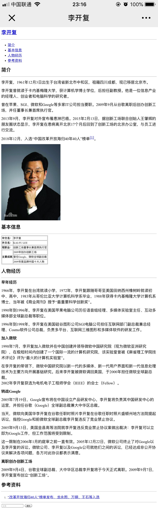

<!-- TOC -->

- [HTML 入门](#html-入门)
- [本地 Windows 计算机 SSH 密钥登录](#本地-windows-计算机-ssh-密钥登录)
- [实例：人物简介html页面](#实例人物简介html页面)
- [apache安装配置](#apache安装配置)
- [CSS入门](#css入门)
    - [Bootstrap](#bootstrap)
    - [CSS样式](#css样式)

<!-- /TOC -->
## HTML 入门
1. HTML 结构
HTML 由大量的标签组成
- 标签分类：结构 <标签名>
  （1）单标签  <标签名 />
  （2）双标签  <标签名></标签名>
- HTML 的固定结构：
    ```html
        <html>
        <head>
        <title>demo 网页</title>
        </head>
        <body>demo 内容</body>
        </html>
    ```
    注意事项：标签必须正确的结束，特别是双标签

2. HTML 属性
HTML 标签可以拥有属性。属性提供了有关 HTML 元素的更多的信息。
属性总是以名称/值对的形式出现，比如：name="value"。
属性总是在 HTML 元素的开始标签中规定。
实例：HTML 链接由 `<a>` 标签定义。链接的地址在 href 属性中指定：
    ```html
        <a href="http://www.google.com">This is a link</a>
    ```
    始终为属性值加引号
    属性值应该始终被包括在引号内。双引号是最常用的，不过使用单引号也没有问题。
    在某些个别的情况下，比如属性值本身就含有双引号，那么您必须使用单引号，例如：
    name='Bill "HelloWorld" Gates'

    下面列出了适用于大多数 HTML 元素的属性：
    <table>
    <tr>
    <th>属性</th>
    <th>值</th>
    <th>描述</th>
    </tr>

    <tr>
    <td>class</td>
    <td><i>classname</i></td>
    <td>规定元素的类名（classname）</td>
    </tr>

    <tr>
    <td>id</td>
    <td><i>id</i></td>
    <td>规定元素的唯一 id</td>
    </tr>

    <tr>
    <td>style</td>
    <td><i>style_definition</i></td>
    <td>规定元素的行内样式（inline style）</td>
    </tr>

    <tr>
    <td>title</td>
    <td><i>text</i></td>
    <td>规定元素的额外信息（可在工具提示中显示）</td>
    </tr>
    </table>

3. HTML 注释
- 注释的作用：可以在源代码中看见，但是在页面运行看不见的代码，可以方便对代码进行解释说明，或者某一段不需要的代码也可以使用注释
- 注释的结构：`<!--注释的内容-->`

4. HTML 标签
- HTML 标题（Heading）是通过 `<h1> - <h6>` 等标签进行定义的，1-6 表示不同级别的标题。
实例:
    ```html
        <h1>This is a heading</h1>
        <h2>This is a heading</h2>
        <h3>This is a heading</h3>
    ```
    注释：
    默认情况下，HTML 会自动地在块级元素前后添加一个额外的空行，比如段落、标题元素前后。
    `<hr />` 标签在 HTML 页面中创建水平线。
    hr 元素可用于分隔内容。
- HTML 段落是通过 `<p>` 标签进行定义的。
实例:
    ```html
        <p>This is a paragraph.</p>
        <p>This is another paragraph.</p>
    ```
    注释：
    浏览器会自动地在段落的前后添加空行。（`<p>` 是块级元素）
    使用空的段落标记 `<p></p>` 去插入一个空行是个坏习惯。用 `<br />` 标签代替它
- HTML 样式
style 属性用于改变 HTML 元素的样式。
    - background-color 属性为元素定义了背景颜色：
        ```html
            <html>
            <body style="background-color:yellow">
            <h2 style="background-color:red">This is a heading</h2>
            <p style="background-color:green">This is a paragraph.</p>
            </body>
            </html>
        ```
    - font-family、color 以及 font-size 属性分别定义元素中文本的字体系列、颜色和字体尺寸：：
        ```html
            <html>
            <body style="background-color:yellow">
            <h1 style="font-family:verdana">A heading</h1>
            <p style="font-family:arial;color:red;font-size:20px;">A paragraph.</p>
            </body>
            </html>
        ```
    - text-align 属性规定了元素中文本的水平对齐方式：
        ```html
            <html>
            <body style="background-color:yellow">
            <h1 style="text-align:center">This is a heading</h1>
            <p>The heading above is aligned to the center of this page.</p>
            </body>
            </html>
        ```
- HTML 文本格式化
    <table class="dataintable">
    <tr>
    <th style="width:30%">标签</th>
    <th style="width:70%">描述</th>
    </tr>
    <tr>
    <td><a href="/tags/tag_font_style.asp">&lt;b&gt;</a></td>
    <td>定义粗体文本。</td>
    </tr>
    <tr>
    <td><a href="/tags/tag_font_style.asp">&lt;big&gt;</a></td>
    <td>定义大号字。</td>
    </tr>
    <tr>
    <td><a href="/tags/tag_phrase_elements.asp">&lt;em&gt;</a></td>
    <td>定义着重文字。</td>
    </tr>
    <tr>
    <td><a href="/tags/tag_font_style.asp">&lt;i&gt;</a></td>
    <td>定义斜体字。</td>
    </tr>
    <tr>
    <td><a href="/tags/tag_font_style.asp">&lt;small&gt;</a></td>
    <td>定义小号字。</td>
    </tr>
    <tr>
    <td><a href="/tags/tag_phrase_elements.asp">&lt;strong&gt;</a></td>
    <td>定义加重语气。</td>
    </tr>
    <tr>
    <td><a href="/tags/tag_sup.asp">&lt;sub&gt;</a></td>
    <td>定义下标字。</td>
    </tr>
    <tr>
    <td><a href="/tags/tag_sup.asp">&lt;sup&gt;</a></td>
    <td>定义上标字。</td>
    </tr>
    <tr>
    <td><a href="/tags/tag_ins.asp">&lt;ins&gt;</a></td>
    <td>定义插入字。</td>
    </tr>
    <tr>
    <td><a href="/tags/tag_del.asp">&lt;del&gt;</a></td>
    <td>定义删除字。</td>
    </tr>
    <tr>
    <td><a href="/tags/tag_strike.asp">&lt;s&gt;</a></td>
    <td class="deprecated"><em>不赞成使用。</em>使用 &lt;del&gt; 代替。</td>
    </tr>
    <tr>
    <td><a href="/tags/tag_strike.asp">&lt;strike&gt;</a></td>
    <td class="deprecated"><em>不赞成使用。</em>使用 &lt;del&gt; 代替。</td>
    </tr>
    <tr>
    <td><a href="/tags/tag_u.asp">&lt;u&gt;</a></td>
    <td class="deprecated"><em>不赞成使用。</em>使用样式（style）代替。</td>
    </tr>
    </table>
    实例：
- HTML 链接是通过 `<a>` 标签进行定义的。
实例:
    ```html
        <a href="http://www.google.com">This is a link</a>
    ```
    提示："链接文本" 不必一定是文本。图片或其他 HTML 元素都可以成为链接。
    - Target 属性
    使用 Target 属性，你可以定义被链接的文档在何处显示。下面的这行会在新窗口打开文档：
    `<a href="http://www.w3school.com.cn/" target="_blank">Visit W3School!</a>`
    - name 属性
    name 属性规定锚（anchor）的名称。
    当使用命名锚（named anchors）时，我们可以创建直接跳至该命名锚（比如页面中某个小节）的链接，这样使用者就无需不停地滚动页面来寻找他们需要的信息了。
    实例:
    首先，我们在 HTML 文档中对锚进行命名（创建一个书签）：
    `<a name="tips">基本的注意事项 - 有用的提示</a>`
    然后，我们在同一个文档中创建指向该锚的链接：
    `<a href="#tips">有用的提示</a>`
    您也可以在其他页面中创建指向该锚的链接：
    `<a href="http://www.w3school.com.cn/html/html_links.asp#tips">有用的提示</a>`
    在上面的代码中，我们将 # 符号和锚名称添加到 URL 的末端，就可以直接链接到 tips 这个命名锚了。
- HTML 图像是通过 `` 标签进行定义的。
实例:
    ```html
        
    ```
- HTML 表格由 `<table>` 标签来定义。每个表格均有若干行（由 `<tr>` 标签定义），每行被分割为若干单元格（由 `<td>` 标签定义）。字母 td 指表格数据（table data），即数据单元格的内容。数据单元格可以包含文本、图片、列表、段落、表单、水平线、表格等等。
实例:
    ```html
        <table >
        <tr>
        <td>row 1, cell 1</td>
        <td>row 1, cell 2</td>
        </tr>
        <tr>
        <td>row 2, cell 1</td>
        <td>row 2, cell 2</td>
        </tr>
        </table>
    ```
- HTML 列表支持有序、无序和定义列表
    - 无序列表是一个项目的列表，此列项目使用粗体圆点（典型的小黑圆圈）进行标记。无序列表始于 `<ul>` 标签。每个列表项始于 `<li>`。
    实例:
    ```html
        <ul>
        <li>Coffee</li>
        <li>Milk</li>
        </ul>
    ```
    - 同样，有序列表也是一列项目，列表项目使用数字进行标记。有序列表始于 `<ol>` 标签。每个列表项始于 `<li>` 标签。
     ```html
        <ol>
        <li>Coffee</li>
        <li>Milk</li>
        </ol>
    ```
    - 自定义列表不仅仅是一列项目，而是项目及其注释的组合。自定义列表以 `<dl>` 标签开始。每个自定义列表项以 `<dt>` 开始。每个自定义列表项的定义以 `<dd>` 开始。
    ```html
        <dl>
        <dt>Coffee</dt>
        <dd>Black hot drink</dd>
        <dt>Milk</dt>
        <dd>White cold drink</dd>
        </dl>
    ```
- HTML `<div>` 和 `<span>`
    - HTML 块元素
    大多数 HTML 元素被定义为块级元素或内联元素。
    注：“块级元素”译为 block level element，“内联元素”译为 inline element。
    块级元素在浏览器显示时，通常会以新行来开始（和结束）。
    例子：`<h1>, <p>, <ul>, <table>`
    - HTML 内联元素
    内联元素在显示时通常不会以新行开始。
    例子：`<b>, <td>, <a>, `

    - HTML `<div>` 元素
    HTML `<div>` 元素是块级元素，它是可用于组合其他 HTML 元素的容器。
    `<div>` 元素没有特定的含义。除此之外，由于它属于块级元素，浏览器会在其前后显示折行。
    如果与 CSS 一同使用，`<div>` 元素可用于对大的内容块设置样式属性。
    `<div>` 元素的另一个常见的用途是文档布局。它取代了使用表格定义布局的老式方法。使用 `<table>` 元素进行文档布局不是表格的正确用法。`<table>` 元素的作用是显示表格化的数据。
    - HTML `<span>` 元素
    HTML `<span>` 元素是内联元素，可用作文本的容器。
    `<span>` 元素也没有特定的含义。
    当与 CSS 一同使用时，`<span>` 元素可用于为部分文本设置样式属性。

## 本地 Windows 计算机 SSH 密钥登录
<b>登录工具</b>
使用 远程登录软件 ，采用 SSH 密钥登录 Linux 实例（本例中选择使用 PuTTY，用户也可以选择其他类型的登录软件）。

<b>操作步骤</b>
1. 安装 Windows 远程登录软件，参考下载地址：https://www.chiark.greenend.org.uk/~sgtatham/putty/latest.html ，分别下载 putty.exe 及 puttygen.exe 两个文件。
2. 选择私钥。打开 puttygen.exe，单击【Load】按钮，在弹窗中首先进入您存放前提条件中下载下来的私钥的路径，然后选择“All File（*.*）”，选择下载好的私钥（例子中为文件david，david是密钥的名称），单击【打开】。

3. 密钥转换。在 key comment 栏中输入密钥名，输入加密私钥的密码，单击【Save private key】，在弹窗中选择您存放密钥的目录，然后在文件名栏输入 密钥名 +".ppk"，单击【保存】按钮。

4. 打开 putty.exe ，进入【Auth】配置。

5. 单击【Browse】按钮，打开弹窗后进入密钥存储的路径，并选择密钥，单击【打开】，返回配置界面，进入【Session】配置。

6. 在Session配置页中，配置服务器的IP，端口，连接类型。
IP：云服务器的公网IP。登录 云服务器控制台，可在列表页及详情页中获取主机公网IP。
端口：云服务器的端口，必须填 22 。（请确保云服务器 22 端口已开放，详见查看 安全组 及 网络ACL）。
7.  在【Saved Sessions】输入框中中输入会话名称（本例为 test ），再单击【Save】按钮，然后双击会话名称或者单击【Open】按钮发起登录请求。


<a href="https://cloud.tencent.com/document/product/213/5436#.E6.9C.AC.E5.9C.B0-windows-.E8.AE.A1.E7.AE.97.E6.9C.BA-ssh-.E5.AF.86.E9.92.A5.E7.99.BB.E5.BD.95">参考资料</a>
## 实例：人物简介html页面
```html
<html>

<head>
    <meta charset="UTF-8">
    <title>李开复</title>
</head>

<body>
    <h1><a href="https://baike.baidu.com/item/%E6%9D%8E%E5%BC%80%E5%A4%8D/294500?fr=aladdin">李开复</a></h1>
    <hr />
    <div></div>
    <nav>
        <ul>
            <li><small><a href="#jianjie">简介</a></small></li>
            <li><small><a href="#table">基本信息</a></small></li>
            <li><small><a href="#jingli">人物经历</a></small></li>
            <li><small><a href="#cankao">参考资料</a></small></li>
        </ul>
    </nav>
    </div>
    <div>
        <h2><a name="jianjie">简介</a></h2>
        <hr />
        <p>李开复，1961年12月3日出生于台湾省新北市中和区，祖籍四川成都，现已移居北京市。</p>
        <p>李开复曾就读于卡内基梅隆大学，获计算机学博士学位，后担任副教授。他是一位信息产业的经理人、创业者和电脑科学的研究者。</p>
        <p>曾在苹果、SGI、微软和Google等多家IT公司担当要职。2009年9月从谷歌离职后创办创新工场，并任董事长兼首席执行官。</p>
        <p>2013年9月，李开复对外宣布罹患淋巴癌。2015年2月13日，据创新工场联合创始人王肇辉的朋友圈状态显示，李开复在患病离开北京17个月后回到了创新工场的北京办公室，与员工进行交流。</p>
        <p>2018年12月，入选“中国改革开放海归40年40人”榜单<sup><a href="https://baike.baidu.com/redirect/0537jA9SRQyn7_-raScc892AqZALTfkZ1-AAdvpAodrIwpCyiciZD6yTqbgCYao18oyhl1ryyMUvTj72FDfkkeY5OwU_DJxb0tTz9CPLqA">[1]</a></sup>。</p>
    </div>
    
    <div>
        <h2><a name="table">基本信息</a></h2>
        <hr />
        <table border="1">
            <tr>
                <th>中文名：</th>
                <td>李开复</td>
            </tr>
            <tr>
                <th>外文名：</th>
                <td>KAI-FU LEE</td>
            </tr>
            <tr>
                <th>现职业：</th>
                <td>创新工场董事长兼首席执行官</td>
            </tr>
            <tr>
                <th rowspan="3">主要成就</th>
                <td>2009年创办创新工场</td>
            </tr>
            <tr>
                <td>曾任Google、微软全球副总裁</td>
            </tr>
            <tr>
                <td>2009年度品牌中国十大人物</td>
            </tr>
        </table>
    </div>
    <div>
        <h2><a name="jingli">人物经历</a></h2>
        <hr />
        <b>早年经历</b><br>
        <p>1966年，李开复在台湾就读小学，1972年，李开复跟随哥哥至美国田纳西州橡树岭就读初中、高中，1983年从哥伦比亚大学计算机科学系毕业，1988年获得卡内基梅隆大学计算机系博士，当年被《商业周刊》授予“最重要科学创新奖”。</p>
        <p>1990年到1996年，李开复在美国苹果电脑公司历任语音组经理、多媒体实验室主任、互动多媒体部全球副总裁等职位。</p>
        <p>1996年到1998年，李开复在美国硅谷图形公司SGI电脑公司担任互联网部门副总裁兼总经理、Cosmo软件公司总裁，负责多平台、互联网三维图形和多媒体软件的研发工作。</p>
        <b>加入微软</b><br>
        <p>1998年7月，李开复加入微软并在中国创建并领导微软中国研究院（现为微软亚洲研究院），在极短时间内创建了一个国际一流的计算机研究院，该实验室曾被《麻省理工学院技术评论》评为“最火的计算机实验室”。</p>
        <p>在李开复的带领下，微软中国研究院以新一代的多媒体、新一代用户界面和新一代信息处理技术为主要方向开展基础研究。后来李开复被微软调回美国，于2000年担任微软全球副总裁。<br />
            2002年李开复获选为电机电子工程师学会（IEEE）的会士（Fellow）。</p>
        <b>转战Google</b><br>
        <p>2005年7月19日，Google宣布将在中国设立产品研发中心，李开复将负责其中国研发中心的运营，并担任谷歌（Google）全球副总裁兼大中华区总裁。</p>
        <p>当天，微软向美国华李开复在谷歌任职时照片李开复在谷歌任职时照片盛顿州地方法院提起诉讼，指控Google和前微软全球副总裁李开复违反了竞业禁止协议。</p>
        <p>2005年9月13日，美国金县高等法院就李开复违反竞业禁止协议案做出裁决：李开复可以立即为Google工作，但工作范围将受到限制。</p>
        <p>这一限制在2006年1月的庭审之前一直有效。2005年12月22日，微软公司终止了对Google以及李开复的诉讼。微软公司、李开复以及Google公司就他们之间的诉讼，已经达成非公开协议来解决各项问题，各方对此协议都表示满意。</p>
        <b>离职创办创新工场</b><br>
        <p>2009年9月4日，谷歌全球副总裁、大中华区总裁李开复将于今天正式离职。2009年9月7日，李开复宣布创立“创新工场”。</p>
    </div>
    <div>
        <h2><a name="cankao">参考资料</a></h2>
        <hr />
        <ol>
            <li><small><a href="https://baike.baidu.com/redirect/0537jA9SRQyn7_-raScc892AqZALTfkZ1-AAdvpAodrIwpCyiciZD6yTqbgCYao18oyhl1ryyMUvTj72FDfkkeY5OwU_DJxb0tTz9CPLqA">“改革开放海归40人”榜单发布，龙永图、万钢、王石等入选</a></small></li>
        </ol>
    </div>
    <div>
        <hr />
        <input placeholder="反馈">
        <button>提交</button>
    </div>
</body>
</html>
```
<b>效果如下:</b>



## apache安装配置
<b>准备：</b>

一、配置防火墙，开启80端口、3306端口

CentOS 7 默认使用的是firewall作为防火墙，这里改为iptables防火墙。

1、关闭firewall：
```
systemctl stop firewalld.service #停止firewall
systemctl disable firewalld.service #禁止firewall开机启动
```
2、安装iptables防火墙
```
yum install iptables-services #安装
vi /etc/sysconfig/iptables #编辑防火墙配置文件
# Firewall configuration written by system-config-firewall
# Manual customization of this file is not recommended.
*filter
:INPUT ACCEPT [0:0]
:FORWARD ACCEPT [0:0]
:OUTPUT ACCEPT [0:0]
-A INPUT -m state --state ESTABLISHED,RELATED -j ACCEPT
-A INPUT -p icmp -j ACCEPT
-A INPUT -i lo -j ACCEPT
-A INPUT -m state --state NEW -m tcp -p tcp --dport 22 -j ACCEPT
-A INPUT -m state --state NEW -m tcp -p tcp --dport 80 -j ACCEPT
-A INPUT -m state --state NEW -m tcp -p tcp --dport 3306 -j ACCEPT
-A INPUT -j REJECT --reject-with icmp-host-prohibited
-A FORWARD -j REJECT --reject-with icmp-host-prohibited
COMMIT
:wq! #保存退出
systemctl restart iptables.service #最后重启防火墙使配置生效
systemctl enable iptables.service #设置防火墙开机启动
```
二、关闭SELINUX
```
vi /etc/selinux/config
#SELINUX=enforcing #注释掉
#SELINUXTYPE=targeted #注释掉
SELINUX=disabled #增加
:wq! #保存退出
setenforce 0 #使配置立即生效
```

<b>安装配置：</b>

一、安装Apache
```
yum install httpd #根据提示，输入Y安装即可成功安装
systemctl start httpd.service #启动apache
systemctl stop httpd.service #停止apache
systemctl restart httpd.service #重启apache
systemctl enable httpd.service #设置apache开机启动
```
二、Apache配置
```
vi /etc/httpd/conf/httpd.conf #编辑文件

#添加，在错误页中显示Apache的版本，Off为不显示
ServerSignature On

#修改为：Options Includes ExecCGI FollowSymLinks（允许服务器执行CGI及SSI，禁止列出目录）
Options Indexes FollowSymLinks

#修改为：AddHandler cgi-script .cgi .pl （允许扩展名为.pl的CGI脚本运行）
AddHandler cgi-script .cgi

#修改为：AllowOverride All （允许.htaccess）
AllowOverride None

#修改为：AddDefaultCharset GB2312　（添加GB2312为默认编码）
AddDefaultCharset UTF-8

#修改为 Options FollowSymLinks（不在浏览器上显示树状目录结构）
Options Indexes FollowSymLinks

#修改为：DirectoryIndex index.html index.htm Default.html Default.htm index.php（设置默认首页文件，增加index.php）
DirectoryIndex index.html

#添加MaxKeepAliveRequests 500 （增加同时连接数）
MaxKeepAliveRequests 500
:wq! #保存退出
```
```
systemctl restart httpd.service #重启apache
rm -f /etc/httpd/conf.d/welcome.conf /var/www/error/noindex.html #删除默认测试页
```
注意：apache默认的程序目录是/var/www/html

<b>传输本地文件到CentOS</b>

命令： scp 本地文件路径 centos文件存放地路径
例如：拷贝本地 token.txt 到 centos 的 home 目录下，注意 ~ 代表 home 目录。


然后提示输入登录密码

然后就开始上传了

远程CentOS传输文件到本地命令： scp centos文件路径 本地文件路径
例如：


## CSS入门
1. CSS是什么
- 层叠样式表(英文全称：Cascading Style Sheets)是一种用来表现HTML或XML等文件样式的计算机语言。
- CSS 能够对网页中元素位置的排版进行像素级精确控制，支持几乎所有的字体字号样式，拥有对网页对象和模型样式编辑的能力。
- 样式通常保存在外部的 .css 文件中。只需要编辑一个简单的 CSS 文档就可以指定页面的布局和外观。

2. CSS语法
- CSS 规则由两个主要的部分构成：选择器，以及一条或多条声明。
- `selector {declaration1; declaration2; ... declarationN }`
- 每条声明由一个属性和一个值组成。每个属性有一个值。属性和值被冒号分开。
- `selector {property: value}`

3. CSS引用方式
- 外部样式表
```css
<head>
<link rel="stylesheet" type="text/css" href="mystyle.css">
</head>
```
- 内部样式表
```css
<head>
<style type="text/css">
body {background-color: red}
p {margin-left: 20px}
</style>
</head>
```
- 内联样式
```css
<p style="color: red; margin-left: 20px">
This is a paragraph
</p>
```

4. CSS选择器
- 类选择器 类名前有一个点号（.）
```css
.center {text-align: center}
<h1 class="center">
This heading will be center-aligned
</h1>
<p class="center">
This paragraph will also be center-aligned.
</p>
```

- ID选择器 ID名前有一个井号（#）
```css
#red {color:red;}
#green {color:green;}
<p id="red">这个段落是红色。</p>
<p id="green">这个段落是绿色。</p>
```

- 派生选择器 依据元素在其位置的上下文关系来定义
```css
li strong {
font-style: italic;
font-weight: normal;
}
<p><strong>我是粗体字，不是斜体字，因为我不在列表当中，所以这个规则对我不起作用</strong></p>
<ol>
<li><strong>我是斜体字。这是因为 strong 元素位于 li 元素内。</strong></li>
<li>我是正常的字体。</li>
</ol>
```

5. CSS盒模型
- 所有HTML元素可以看作盒子
- CSS盒模型本质上是一个盒子，它包括：边距，边框，填充和实际内容。

>Margin(外边距) - 清除边框外的区域，外边距是透明的。
Border(边框) - 围绕在内边距和内容外的边框。
Padding(内边距) - 清除内容周围的区域，内边距是透明的。
Content(内容) - 盒子的内容，显示文本和图像。
- 盒子模型演示
```html
<!DOCTYPE html>
<html>
<head>
<meta charset="utf-8">
<title></title>
<style>
*{margin:0;padding:0}
.div1 {
background-color: #f00;
width: 300px;
height: 100px;
}
.div2 {
background-color: #00f;
width: 300px;
border: 25px solid green;
padding: 25px;
margin: 25px;
}
</style>
</head>
<body>
```


6. CSS定位
- CSS 有三种基本的定位机制：普通流、浮动和绝对定位。
- 普通流：除非专门指定，否则所有框都在普通流中定位。普通流中元素框的位置由元素在(X)HTML中的位置决定。
- 块级框从上到下一个接一个地排列，框之间的垂直距离是由框的垂直外边距计算出来。

相对定位（ relative ）
- 定位元素的位置相对于它在普通流中的位置进行移动
- 使用相对定位的元素不管它是否进行移动，元素仍要占据它原来的位置

```html
<!DOCTYPE html>
<html>
<head>
<meta charset="utf-8">
<title></title>
<style>
*{margin:0;padding:0}
.box1{
background-color: red;
width:100px;
height:100px;
}
.box2{
background-color: yellow;
width:100px;
height:100px;
position: relative;
left: 20px;
}
.box3{
background-color: blue;
width:100px;
height:100px;
position: relative;
right: 20px;
}
</style>
</head>
<body>
<h2>相对定位演示</h2>
<div class="box1">box1</div>
<div class="box2">box2</div>
<div class="box3">box3</div>
</body>
</html>
```


绝对定位（ absolute ）
- 绝对定位的元素位置是相对于距离它最近的那个已定位的祖先(相对/绝对)(指代码中包含它的那个)元素决定的
- 与相对定位相反， 绝对定位使元素与文档流无关， 因此不占据空间

```html
<!DOCTYPE html>
<html>
<head>
<meta charset="utf-8">
<title></title>
<style>
*{margin:0;padding:0}
.relative {
    position: relative;
width: 600px;
height: 400px;
background-color: #f00;
}
.absolute {
position: absolute;
top: 120px;
right: 0;
width: 300px;
height: 200px;
background-color: #00f;
}
</style>
</head>
<body>
<h2>绝对定位演示</h2>
<div class="relative"></div>
<div class="absolute"></div>
</body>
</html>
```

若改为
```html
<div class="relative">
    <div class="absolute"></div>
</div>
```


CSS浮动
- 浮动的框脱离普通流。
- 浮动的框可以在左右移动，直到它的外边框边缘碰到包含框或另一个浮动框的边缘。
- 如果包含块太窄，无法容纳水平排列的浮动元素，那么其他浮动块向下移动。
- 行内元素会围绕着浮动框排列。

- 把框 1 向右浮动时，它脱离文档流并且向右移动，直到它的右边缘碰到包含框的右边缘。

- 当框 1 向左浮动时，它脱离文档流并且向左移动，直到它的左边缘碰到包含框的左边缘。因为它不再处于文档流中，所以它不占据空间，实际上覆盖住了框 2，使框 2 从视图中消失。
- 如果把所有三个框都向左移动，那么框 1 向左浮动直到碰到包含框，另外两个框向左浮动直到碰到前一个浮动框。

- 如果包含框太窄，无法容纳水平排列的三个浮动元素，那么其它浮动块向下移动，直到有足够的空间。如果浮动元素的高度不同，那么当它们向下移动时可能被其它浮动元素“卡住”


清除浮动
- 元素浮动之后，周围的元素会重新排列，为了避免这种情况，使用clear 属性。
- clear 属性指定元素两侧是否能出现浮动元素。
- 语法：clear : none | left | right | both
    - none : 默认值。允许两边都可以有浮动对象
    - left : 不允许左边有浮动对象
    - right : 不允许右边有浮动对象
    - both : 不允许有浮动对象

父级div定义 overflow:hidden
- 对父级CSS选择器加overflow:hidden样式，可以清除父级内使用float产生浮动。

常见用法
- div是块元素，不会进行横向排列，因此如果想让两个div水平排列，需要使用浮动方式。

### Bootstrap
1. 特点
- Bootstrap是Twitter推出的一个开源的用于前端开发的工具包。它由Twitter的设计师Mark Otto和JacobThornton合作开发，是一个CSS/HTML框架。Bootstrap提供了优雅的HTML和CSS规范，它即是由动态CSS语言Less写成。Bootstrap一经推出后颇受欢迎，一直是GitHub上的热门开源项目，包括NASA的MSNBC（微软全国广播公司）的Breaking News都使用了该项目
- Bootstrap中包含了丰富的Web组件，根据这些组件，可以快速的搭建一个漂亮、功能完备的网站。其中包括以下组件：下拉菜单、按钮组、按钮下拉菜单、导航、导航条、面包屑、分页、排版、缩略图、警告对话框、进度条、媒体对象等。
- Bootstrap是基于jQuery框架开发的，它在jQuery框架的基础上进行了更为个性化和人性化的完善，形成一套自己独有的网站风格，并兼容大部分jQuery插件。
2. jQuery
- jQuery是一个快速、简洁的JavaScript框架，是继Prototype之后又一个优秀的JavaScript代码库（或JavaScript框架）。jQuery设计的宗旨是“write Less，Do More”，即倡导写更少的代码，做更多的事情。它封装JavaScript常用的功能代码，提供一种简便的JavaScript设计模式，优化HTML文档操作、事件处理、动画设计和Ajax交互。
- jQuery的核心特性可以总结为：具有独特的链式语法和短小清晰的多功能接口；具有高效灵活的css选择器，并且可对CSS选择器进行扩展；拥有便捷的插件扩展机制和丰富的插件。jQuery兼容各种主流浏览器，如IE6.0+、FF 1.5+、Safari 2.0+、Opera 9.0+等。

### CSS样式
1. 背景
CSS 允许应用纯色作为背景，也允许使用背景图像创建相当复杂的效果。
CSS 在这方面的能力远远在 HTML 之上。

- 背景色
可以使用 background-color 属性为元素设置背景色。这个属性接受任何合法的颜色值。
这条规则把元素的背景设置为灰色：
`p {background-color: gray;}`
如果希望背景色从元素中的文本向外少有延伸，只需增加一些内边距：
`p {background-color: gray; padding: 20px;}`
可以为所有元素设置背景色，这包括 body 一直到 em 和 a 等行内元素。
background-color 不能继承，其默认值是 transparent。transparent 有“透明”之意。也就是说，如果一个元素没有指定背景色，那么背景就是透明的，这样其祖先元素的背景才能可见。

- 背景图像
要把图像放入背景，需要使用 background-image 属性。background-image 属性的默认值是 none，表示背景上没有放置任何图像。
如果需要设置一个背景图像，必须为这个属性设置一个 URL 值：
`body {background-image: url(/i/eg_bg_04.gif);}`
大多数背景都应用到 body 元素，不过并不仅限于此。
下面例子为一个段落应用了一个背景，而不会对文档的其他部分应用背景：
`p.flower {background-image: url(/i/eg_bg_03.gif);}`
甚至可以为行内元素设置背景图像，下面的例子为一个链接设置了背景图像：
`a.radio {background-image: url(/i/eg_bg_07.gif);}`
理论上讲，甚至可以向 textareas 和 select 等替换元素的背景应用图像，不过并不是所有用户代理都能很好地处理这种情况。
另外还要补充一点，background-image 也不能继承。事实上，所有背景属性都不能继承。

- 背景重复
如果需要在页面上对背景图像进行平铺，可以使用 background-repeat 属性。
属性值 repeat 导致图像在水平垂直方向上都平铺，就像以往背景图像的通常做法一样。repeat-x 和 repeat-y 分别导致图像只在水平或垂直方向上重复，no-repeat 则不允许图像在任何方向上平铺。
默认地，背景图像将从一个元素的左上角开始。请看下面的例子：
```css
body
  { 
  background-image: url(/i/eg_bg_03.gif);
  background-repeat: repeat-y;
  }
```

- 背景定位
可以利用 background-position 属性改变图像在背景中的位置。
下面的例子在 body 元素中将一个背景图像居中放置：
```css
body
  { 
    background-image:url('/i/eg_bg_03.gif');
    background-repeat:no-repeat;
    background-position:center;
  }
```
为 background-position 属性提供值有很多方法。首先，可以使用一些关键字：top、bottom、left、right 和 center。通常，这些关键字会成对出现，不过也不总是这样。还可以使用长度值，如 100px 或 5cm，最后也可以使用百分数值。不同类型的值对于背景图像的放置稍有差异。

关键字
图像放置关键字最容易理解，其作用如其名称所表明的。例如，top right 使图像放置在元素内边距区的右上角。
根据规范，位置关键字可以按任何顺序出现，只要保证不超过两个关键字 - 一个对应水平方向，另一个对应垂直方向。
如果只出现一个关键字，则认为另一个关键字是 center。
所以，如果希望每个段落的中部上方出现一个图像，只需声明如下：
```css
p
  { 
    background-image:url('bgimg.gif');
    background-repeat:no-repeat;
    background-position:top;
  }
```

百分数值
百分数值的表现方式更为复杂。假设你希望用百分数值将图像在其元素中居中，这很容易：
```css
body
  { 
    background-image:url('/i/eg_bg_03.gif');
    background-repeat:no-repeat;
    background-position:50% 50%;
  }
```
这会导致图像适当放置，其中心与其元素的中心对齐。换句话说，百分数值同时应用于元素和图像。也就是说，图像中描述为 50% 50% 的点（中心点）与元素中描述为 50% 50% 的点（中心点）对齐。
如果图像位于 0% 0%，其左上角将放在元素内边距区的左上角。如果图像位置是 100% 100%，会使图像的右下角放在右边距的右下角。
因此，如果你想把一个图像放在水平方向 2/3、垂直方向 1/3 处，可以这样声明：
```css
body
  { 
    background-image:url('/i/eg_bg_03.gif');
    background-repeat:no-repeat;
    background-position:66% 33%;
  }
```
如果只提供一个百分数值，所提供的这个值将用作水平值，垂直值将假设为 50%。这一点与关键字类似。
background-position 的默认值是 0% 0%，在功能上相当于 top left。这就解释了背景图像为什么总是从元素内边距区的左上角开始平铺，除非您设置了不同的位置值。

长度值
长度值解释的是元素内边距区左上角的偏移。偏移点是图像的左上角。
比如，如果设置值为 50px 100px，图像的左上角将在元素内边距区左上角向右 50 像素、向下 100 像素的位置上：
```css
body
  { 
    background-image:url('/i/eg_bg_03.gif');
    background-repeat:no-repeat;
    background-position:50px 100px;
  }
```
注意，这一点与百分数值不同，因为偏移只是从一个左上角到另一个左上角。也就是说，图像的左上角与 background-position 声明中的指定的点对齐。

背景关联
如果文档比较长，那么当文档向下滚动时，背景图像也会随之滚动。当文档滚动到超过图像的位置时，图像就会消失。
可以通过 background-attachment 属性防止这种滚动。通过这个属性，可以声明图像相对于可视区是固定的（fixed），因此不会受到滚动的影响：
```css
body 
  {
  background-image:url(/i/eg_bg_02.gif);
  background-repeat:no-repeat;
  background-attachment:fixed
  }
```
background-attachment 属性的默认值是 scroll，也就是说，在默认的情况下，背景会随文档滚动。